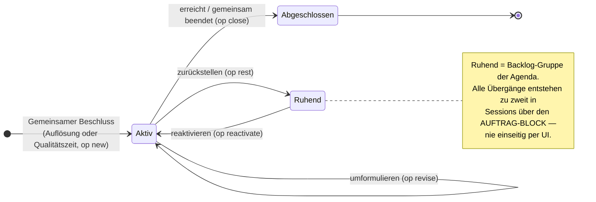

# Agenda-Workflow — Gesprächspunkte, Ziele und das eine Gefäß „Qualitätszeit"

Stand: Sprint 80. Nutzerseitige Begriffslandkarte (vier Begriffe, klar getrennt):

| Begriff | Bedeutung | intern |
|---|---|---|
| **Gemeinsamer Raum** | der Ort (Screen), nie eine Session | `scrShared` |
| **Qualitätszeit** | die wiederkehrende gemeinsame Session — EIN Gefäß, zwei Modi | `art: "moment"` |
| **Gemeinsame Auflösung** | der einmalige Schritt nach der Auftragsklärung | `art: "gemeinsam"` |
| **Gemeinsame Momente** | der Rückblick auf vergangene Qualitätszeiten | `momentLog` |

„Gemeinsame Session" existiert nutzerseitig nicht mehr. Die Qualitätszeit trägt
beide Modi — **Themen besprechen** (Agenda, Vorgemerktes, Ziel-Kandidaten) und
**gemeinsame Zeit gestalten** (Einladungen) — die Begleitung klärt die Richtung
beiläufig im Gespräch; es gibt keine Kategorie-Wahl vorab (Prompt-Abschnitt
„ZWEI MODI, EIN GEFÄSS").

## 1 · Weg des Gesprächspunkts

Aus dem Regal wird **nie** direkt ein Ziel — nur der gemeinsame Beschluss in
einer Session erzeugt eins.

```mermaid
flowchart TB
    R["Regal<br/><i>Einblick des Partners</i>"]
    G["Gate in Session<br/><i>„Auf die Agenda (Thema)"</i>"]
    R -->|"In der Qualitätszeit besprechen<br/>= Punkt MIT Vormerkung"| N
    R -->|"Als Ziel vorschlagen<br/>= Punkt + Kandidat-Marke"| N
    G --> N

    subgraph AGENDA["Gemeinsame Agenda"]
        N["Gesprächspunkte<br/><i>offen · teils vorgemerkt · teils Ziel-Kandidat</i>"]
    end

    N -->|"Kontext-Marker: VORGEMERKT /<br/>ZIEL-KANDIDAT — Begleitung greift aktiv auf"| QZ["QUALITÄTSZEIT<br/><i>ein Gefäß, zwei Modi:<br/>besprechen · Zeit gestalten</i>"]
    N -->|"manuell: „Haben wir selbst geklärt ✓""| SK["selbst geklärt"]
    QZ -->|"Protokoll markiert (addressed)"| B["besprochen"]
    QZ -->|"GEMEINSAMER BESCHLUSS<br/>AUFTRAG-BLOCK op:new"| Z["neues Ziel (aktiv)"]

    style QZ fill:#EEEDFE,stroke:#534AB7
    style Z fill:#EEEDFE,stroke:#534AB7
    style N fill:#E1F5EE,stroke:#0F6E56
    style SK fill:#F1EFE8,stroke:#5F5E5A
    style B fill:#F1EFE8,stroke:#5F5E5A
```

Regeln:

- **Vormerkung** (`vormerkung: true`) ist Richtung, kein Abräumen: Der Punkt
  bleibt `open`; die Begleitung spricht ihn in der Qualitätszeit von sich aus an.
  Der „besprechen"-Weg aus dem Regal merkt gleich vor (wer übernimmt, will
  besprechen); Punkte aus Gates lassen sich in der Agenda nachträglich vormerken.
- **Ziel-Kandidat** (`zielKandidat: true`): Die Begleitung lädt zur Entscheidung
  zu zweit ein; erst der Beschluss (AUFTRAG-BLOCK `op:"new"`) erzeugt das Ziel und
  markiert den Punkt als besprochen. Die UI kann niemals einseitig ein Ziel anlegen.
- Abgeräumt wird ausschließlich durchs Session-Protokoll (`addressed` →
  besprochen) oder manuell („Haben wir selbst geklärt ✓" → selbst geklärt).

## 2 · Lebenszyklus eines Ziels (Entwicklungsthema)



Die Agenda zeigt Ziele in der Gruppe **„Entwicklungsthemen / Ziele"** (mit dem
Backlog als ruhender Untergruppe), Gesprächspunkte getrennt davon in
**„Gesprächspunkte"** — zwei eigene Kartenblöcke (`.pb-ag-ziele` mit
Akzentleiste, `.pb-ag-punkte` neutral).
