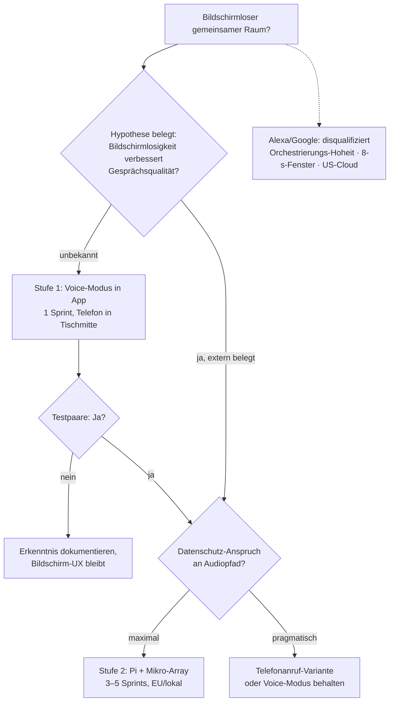

# Design-Notiz · Bildschirmloser gemeinsamer Raum (Voice)

**Stand:** 2. Juli 2026 · Status: Forschung, keine Bau-Entscheidung

## Ausgangsfrage

Wie ließe sich der gemeinsame Raum ohne Bildschirm realisieren — z. B. mit Alexa oder ähnlichen Sprachassistenten?

## Konzeptioneller Vorab-Befund

Die gemeinsame Session ist von allen Modulen das **am besten für Stimme geeignete**: Sie ist ohnehin reines Gespräch mit Drei-Akt-Dramaturgie, Moderation und Eskalationsleiter. Stimme bringt sogar etwas zurück, das das Verbalisierungs-Prinzip (Invariante Linie 8) bisher kompensieren musste: **Prosodie, Tempo und Anspannung sind wieder im Kanal.** Der Bildschirm-Verzicht ist also kein Feature-Verzicht, sondern potenziell ein Qualitätsgewinn — sofern zwei harte Designprobleme gelöst sind, die *vor* jeder Plattformwahl stehen.

## Zwei harte Designprobleme (plattformunabhängig)

### Problem 1 — Sprecher-Zuschreibung

Eval-Szenario SPR-05 existiert nicht zufällig: Schreibt das System Annas Worte Bernd zu, ist das im Konfliktgespräch kein Fehler, sondern ein Schaden — die Live-Übersetzung „zuerst beim Sprecher" wird sinnlos, wenn der Sprecher falsch ist. Lösungen in aufsteigender Eleganz:

1. **Push-to-talk je Person** (zwei Tasten): robust, aber unnatürlich und gesprächshemmend.
2. **Sprecher-Diarisierung** per Voice-Embedding: gut, aber fehleranfällig bei emotionaler Stimme und Durcheinanderreden — genau den Momenten, die zählen.
3. **Moderations-Konvention:** Das System erzeugt die Zuordnung selbst („Anna, magst du beginnen?").

Vermutlich braucht es **Diarisierung plus eine neue Invariante:** *Bei Unsicherheit über den Sprecher fragt das System, statt zuzuschreiben.* Diese Invariante gehört in die Haltungs-Charta, sobald Voice gebaut wird — und SPR-05 bekäme eine Voice-Variante im Eval-Katalog.

### Problem 2 — Verdeckte Erhebungen

Startwerte, Prozessreflexion und Zweitschätzungen leben von Verdecktheit — und **Verdecktheit gibt es im selben Raum per Stimme prinzipiell nicht.** Das löst keine Plattform. Die Antwort ist hybrid:

> Das gesprochene Gemeinsame läuft bildschirmlos; die verdeckten Momente bleiben auf den privaten Telefonen. („Nehmt kurz beide euer Handy und gebt verdeckt ab — ich sage euch, wenn beide Werte da sind.")

Das ist dramaturgisch stimmig: **Der Bildschirm erscheint nur dort, wo er das Geheimnis schützt.**

## Plattform-Bewertung

### Alexa — nicht geeignet (drei Disqualifikationen)

1. **Interaktionsmodell:** Klassische Custom Skills sind streng rundenbasiert mit einem Mikrofonfenster von ca. acht Sekunden für die Antwort. Ein Paar, das nachdenkt, schweigt oder sich unterbricht, sprengt das Modell sofort — und das System kann nicht deeskalierend *dazwischengehen*, was die Eskalationsleiter braucht.
2. **Orchestrierungs-Hoheit:** Beim neuen Alexa+ liefern Entwickler API-Definitionen und Beschreibungen; Amazons LLM orchestriert die Aufrufe und konstruiert die Antwort an den Kunden. Das heißt: *Deren* Modell führt das Gespräch und ruft unsere Dienste nur auf. Haltungs-Charta, Spiegel-Grammatik und Sicherheits-Weichen leben aber im System-Prompt — **der gehört dann Amazon, nicht uns.** Architektonisch disqualifizierend.
3. **Datenschutz:** Audio intimer Paargespräche durch US-Cloud-Infrastruktur steht quer zur Mistral/DSGVO-Linie des Produkts.

Analoges gilt sinngemäß für Google Assistant / Nest.

### Stufe 1 — Voice-Modus in der bestehenden App (Empfehlung)

Ein Telefon liegt in der Tischmitte, Display aus oder abgewandt. **Die halbe Miete ist gebaut:** Die Diktatfunktion aus Sprint 9 liefert STT. Es fehlen:

- **TTS** für die Antworten: Browser-SpeechSynthesis als Nullversion, eine TTS-API (EU-Anbieter prüfbar) für Qualität.
- **Auto-Listen-Zyklus** statt Knopfdruck (Antwort zu Ende → Mikro auf).
- Sprecher-Zuordnung in der Nullversion per Moderations-Konvention (Problem-1-Lösung 3).

Aufwand: **ein Sprint.** Kein neues Haus, kein neuer Kanal, dieselbe Worker-API. Damit lässt sich die eigentliche offene Frage **empirisch** testen: *Verändert Bildschirmlosigkeit die Gesprächsqualität wirklich?* Erst ein belegtes Ja rechtfertigt Stufe 2.

### Stufe 2 — Eigene Hardware („ein Kern, drittes Haus")

Raspberry Pi + Konferenzmikrofon-Array (z. B. ReSpeaker — kann Sprecher*richtung* erkennen, hilft Problem 1) + lokales Wake-Word + Whisper (lokal oder EU-gehostet) + TTS, dahinter unverändert die Worker-API. DSGVO-sauber, konsequent zur Architektur — aber ein echtes Hardware-Projekt: **grob 3–5 Sprints**, wobei Audio-Robustheit (Raumhall, Abstand, Nebengeräusche) erfahrungsgemäß der Zeitfresser ist.

### Zwischenoption — Telefonanruf

Die gemeinsame Session als Anruf (Voice-Agent-Infrastruktur wie LiveKit/Pipecat + SIP). „Wir rufen unsere Begleitung an" ist ritueller als jede Box und braucht null Hardware — aber wieder ein Drittanbieter im Audiopfad.

## Entscheidungsbaum

## Offene Punkte für die Bau-Phase (falls Stufe 1 kommt)

- Neue Invariante „Nachfragen statt Zuschreiben bei Sprecher-Unsicherheit" in die Haltungs-Charta.
- SPR-05-Voice-Variante in den Eval-Katalog.
- Hybrid-Choreografie für verdeckte Erhebungen (Telefon-Einschub) in Slice 5 nachziehen.
- TTS-Anbieterwahl unter denselben Kriterien wie die LLM-Provider-Strategie (EU, AVV).
