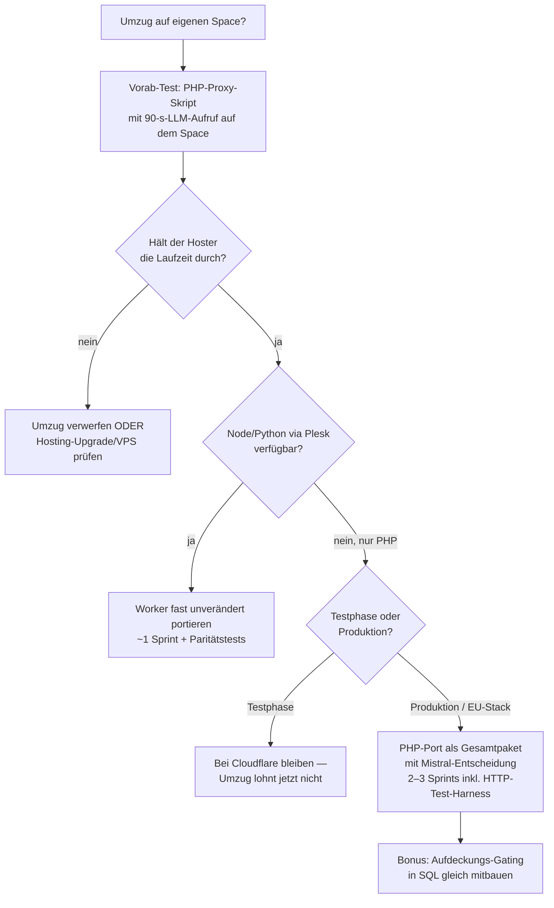

# Design-Notiz · Umzug auf eigenen Hosting-Space (FTP + MySQL)

**Stand:** 2. Juli 2026 · Status: Forschung, keine Bau-Entscheidung

## Ausgangsfrage

Wie aufwändig wäre ein Umzug von Cloudflare (Workers + KV + Pages) auf den eigenen Hosting-Space (FTP + MySQL)? Vor- und Nachteile?

## Ausgangslage-Interpretation

FTP + MySQL heißt praktisch: klassisches **Shared Hosting mit PHP** als einziger Serversprache (LAMP-Stack) — kein Node, keine Worker, keine Hintergrundprozesse. *(Zu verifizieren: Manche Hoster bieten über Plesk auch Node/Python — das würde die Rechnung deutlich verändern, da der Worker-Code dann nahezu unverändert liefe.)*

## Aufwandsanalyse nach Schichten

### Trivial: Frontend und Datenmodell

- **Frontend:** Statische Dateien per FTP hochladen — der Client spricht ohnehin nur `/api/…`. Null Anpassung.
- **Datenmodell:** Der KV-Store ist eine einzige Tabelle:
  ```sql
  CREATE TABLE kv (
    k VARCHAR(191) PRIMARY KEY,
    v MEDIUMTEXT NOT NULL,
    expires_at DATETIME NULL
  );
  ```
  Die KV-Semantik inklusive TTL bildet sich fast 1:1 ab (TTL via `expires_at` + Aufräum-Cron). Datenmigration = Export/Import.

### Der eigentliche Preis: Worker-Port nach PHP

Zu portieren: Auth (Magic-Links mit Einmal-Konsum, Session-Cookies mit Touch-to-extend), Router mit Feld-Whitelists, Quota (Kontingent/Rate/Duplikat), LLM-Proxy. Vom Codeumfang überschaubar — **grob 400–600 Zeilen PHP.**

Aber: Die 29 Worker-Tests inklusive der **Auth-Matrix** („Bernd liest Anna nicht" in vier Angriffsformen, Paar-Isolation, 401-Matrix, Token-Regeln, Denial-of-Wallet) beweisen derzeit die *echte* Laufzeit über Miniflare. Ein PHP-Port ohne neues Test-Geschirr wäre eine **ungeprüfte Neuimplementierung der sicherheitskritischsten Schicht.** Das ist der versteckte Aufwand — größer als der Code selbst.

**Saubere Lösung:** Die API-Tests von Miniflare auf **HTTP-Ebene abstrahieren**, sodass dieselbe Suite gegen beide Server läuft (Worker via Miniflare, PHP via lokalem Server). Das ist der Paritäts-Wächter-Gedanke, auf den Server ausgedehnt: *ein API-Kontrakt, zwei Implementierungen, eine Beweis-Suite.* Nebeneffekt: Der Kontrakt wird dadurch auch für künftige Plattformen (z. B. VPS) formalisiert.

**Realistische Schätzung: 2–3 Sprints** (PHP-Port + MySQL-Schema + HTTP-Test-Harness + Paritätsnachweis).

### Das technische Hauptrisiko: Timeouts

LLM-Antworten dauern 10–60 Sekunden. Shared Hosting hat typischerweise `max_execution_time` 30–60 s und FastCGI-Puffer, die lange Verbindungen kappen oder Streaming zerhacken. Ohne Streaming geht es (die App streamt bisher ohnehin nicht) — aber ob der Hoster 60–120 s Skriptlaufzeit für einen Proxy-Request durchhält, ist **die erste zu klärende Frage.**

> **Vorab-Test (vor jeder weiteren Planung):** Ein 20-Zeilen-PHP-Skript auf den Space legen, das einen echten LLM-Aufruf mit langer Antwort proxied (`curl`, 90 s). Scheitert das, ist der Umzug tot, bevor er beginnt.

## Vor- und Nachteile

**Dafür spricht:**

- **Datenhaltung beim (vermutlich deutschen) Hoster mit AVV** — real wertvoll für die Vertrauensgeschichte des Produkts. Cloudflare KV repliziert global; regionale Bindung gibt es im Free-Tier nicht.
- **MySQL statt KV:** Transaktionen und Abfragbarkeit. DSGVO-Auskunft und -Löschung werden leichter; das **serverseitige Aufdeckungs-Gating der Mess-Werte** (offener Punkt aus Sprint 12) ließe sich in SQL eleganter bauen als in KV.
- Kein Vendor-Lock-in, keine Free-Tier-Willkür, volle Kontrolle über Backups.
- Latenz einer einzelnen Region ist für ein Paar in Deutschland irrelevant (kein Edge-Bedarf).

**Dagegen spricht:**

- **Ungeprüfte Neuschreibung der Sicherheitsschicht** — nur durch das HTTP-Test-Harness heilbar (Hauptkostenpunkt).
- **Timeout-/Puffer-Risiko** beim LLM-Proxy (Vorab-Test entscheidet).
- TLS-, Update- und Härtungsverantwortung liegt beim Betreiber; Cron nötig fürs TTL-Aufräumen.
- **Ehrliche Einordnung:** Die *sensibelsten* Daten verlassen den Server sowieso Richtung LLM-Provider. Das Hosting verschiebt nur Speicherung und Transport — das Vertrauensargument gehört primär zur Provider-Wahl (Mistral), erst sekundär zum Hosting.

## Entscheidungsbaum



## Empfehlung

Für die **Testphase bei Cloudflare bleiben** — der Umzug löst kein aktuelles Problem und kostet den Auth-Matrix-Beweis. Der eigene Space wird relevant als Teil des **Gesamtpakets „EU-Stack"** zusammen mit der Mistral-Produktionsentscheidung: EU-Hosting + EU-LLM + AVV-Kette ist dann ein konsistentes Vertrauensversprechen statt einer halben Maßnahme. Der Timeout-Vorab-Test kostet eine Stunde und kann jederzeit laufen — sein Ergebnis konserviert oder beerdigt die Option faktenbasiert.
