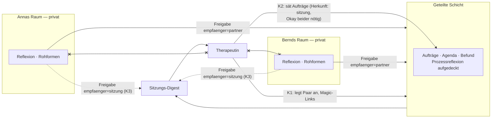

# Design-Notiz · Partnerschaft mit Paartherapeut:innen

**Stand:** 2. Juli 2026 · Status: Strategie-Forschung, keine Bau-Entscheidung

## Ausgangslage: die umgedrehte Richtung

Bisher denkt das System die Profi-Beziehung in **eine** Richtung: Die Eskalationsleiter zeigt bei Bedarf *hinaus* zu (unbekannten) Fachpersonen (`eskalation-an-profis.md`). Die Partnerschafts-Idee dreht die Richtung um: **Ein Paar ist bereits bei einer Therapeutin, und diese initiiert die Toolnutzung** — das System wird zur Zwischenzeit-Infrastruktur einer laufenden Therapie ("Blended Care" / adjunktive digitale Intervention, ein in der Psychotherapie-Forschung etabliertes Muster; prominentes Vorbild im Paarbereich: das Gottman-Ökosystem aus Methode, Tools und Therapeuten-Zertifizierung).

Zwei Dinge werden dadurch strukturell **besser** als im Standalone-Fall:

1. **Die Eskalation bekommt eine Adresse.** Statt „such dir professionelle Hilfe" (hohe Hürde, unbekanntes Gegenüber) heißt es: „Das klingt, als gehörte es in eure nächste Sitzung bei [Name]." Die Schwelle sinkt, der Ton wird wärmer, und die Übergabe ist konsentiert.
2. **Das Vertriebs- und Vertrauensproblem löst sich am richtigen Ort.** Beziehungsdaten sind das sensibelste Gut; die Empfehlung durch die eigene Therapeutin ist der stärkste denkbare Vertrauenstransfer — stärker als jedes Marketing.

## Kollaborationsmodelle (aufsteigend nach Integrationstiefe)

### K0 — Fachlicher Beirat (sofort möglich, ohne Produktänderung)

Therapeut:innen als Reviewer der Haltungs-Charta, der Prompts und des Eval-Katalogs; Supervision der GATE-B-Familie. Nutzen: fachliche Absicherung, Glaubwürdigkeit, Haftungs-Hygiene — und der natürliche Einstieg in jede tiefere Partnerschaft. *Die Judge-Rolle im Eval-Harness ist wie gemacht für professionelle Gegenprüfung ("ROT — menschlich gegenzuprüfen" bekäme eine fachliche Instanz).*

### K1 — Therapeutin als Einrichterin (Verordnungsmodell)

Die Therapeutin legt das Paar an und übergibt die beiden Magic-Links — technisch existiert das bereits fast: `createCouple` liefert genau diese zwei Links. Ein minimales Therapeuten-Portal ist kaum mehr als „Paar anlegen, Links aushändigen, Liste eigener Paare sehen (nur: existiert/aktiv, keine Inhalte)". Das Tool arbeitet zwischen den Sitzungen; die Therapie bleibt die Primärintervention.

### K2 — Therapeutin als Saatgeberin

In der Sitzung Vereinbartes wird als Auftrag ins System gesät („In der Sitzung vom 12.8. vereinbart: …", Status aktiv, Herkunft `sitzung`). Das System pflegt, misst Passung, erinnert nicht (merken statt melden) — und die Prozessreflexion liefert der nächsten Sitzung Substanz. Wichtig: Säen ja, **verfügen nein** — die Auftrags-Hoheit des Paares (Okay beider) gilt auch gegenüber der Therapeutin.

### K3 — Therapeutin als dritte Freigabe-Empfängerin

Die eigentliche Architektur-Frage. **Die Geheimnis-Architektur bleibt unverhandelbar:** Eine Therapeutin, die Transkripte liest, zerstörte exakt den Reflexionsraum, der den Produktkern ausmacht. Die saubere Erweiterung ist stattdessen: Der Übergabe-Pfad (Vertrag 3) bekommt neben Partner und gemeinsamem Raum einen **dritten möglichen Empfänger** — nichts quert ohne explizites Häkchen, aber das Paar (bzw. die einzelne Person) *kann* Material gezielt für die nächste Sitzung freigeben („Das möchte ich bei [Name] besprechen"). Die Therapeutin sieht ausschließlich Freigegebenes plus die ohnehin geteilte Ebene (Aufträge, Befund) — nie Privates, nie Rohformen.

Daraus ergibt sich fast gratis ein **Sitzungs-Vorbereitungs-Digest**: eine kompakte Zusammenstellung aus Freigaben + Auftragsstand + aufgedeckter Prozessreflexion vor jedem Termin. Das spart Sitzungszeit — das härteste Nutzenargument für die Therapeutin.

### K4 — Praxis-Instanz / White-Label

Die Praxis bietet das Tool unter eigenem Namen an. Erst sinnvoll, wenn K1–K3 sich bewährt haben; vorher Overhead ohne Erkenntnisgewinn.

## Monetarisierungsmodelle

| Modell | Mechanik | Bewertung |
|---|---|---|
| **Praxislizenz (Flat)** | Praxis zahlt monatlich für bis zu N aktive Paare | Planbar für beide Seiten; passt zu K1–K3; empfohlen als Startmodell |
| **Pro-Paar-Lizenz** | Preis je aktivem Paar/Monat, Praxis reicht durch oder inkludiert | Skaliert sauber; Abrechnungslogik = Quota-Infrastruktur existiert schon |
| **Paar zahlt, Therapeuten-Code verknüpft** | Paar aboniert selbst; Code verbindet Praxis (Portal für die Therapeutin kostenlos) | Sauberste Anreizstruktur: niemand verdient an der Nutzungs*dauer* des anderen |
| **Zertifizierung/Schulung** | Einführungsworkshop + Materialien als Produkt (Gottman-Muster) | Gutes Zweitprodukt; erzeugt Qualität und Bindung; erst ab mehreren Praxen sinnvoll |
| ~~Revenue-Share pro Nutzung~~ | Therapeutin verdient an Nutzungsvolumen | **Verworfen:** Fehlanreiz (mehr Toolnutzung ≠ mehr Paarwohl) — kollidiert mit der Ko-Regulations-Grenze und der 72-h-Dosierungsphilosophie |
| ~~Vermittlungsprovision~~ | System verdient an Zuweisungen zu Partnerpraxen (oder umgekehrt) | **Verworfen:** Für approbierte Psychotherapeut:innen berufsrechtlich untersagt (Zuweisung gegen Entgelt); für nicht-approbierte Paarberater:innen rechtlich weicher, aber es korrumpiert die Klasse-C-Tonlage — ein Eskalations-Angebot, das strukturell Lead-Generierung ist, zerstört „Information statt Alarm" |

**Ethischer Filter für alle Modelle:** Die Missbrauchsschutz-Logik (zeitliche Dosierung statt Umsatzmaximierung) darf durch kein Erlösmodell unterlaufen werden. Ein Modell, das von *mehr* Nutzung profitiert, widerspricht einem Produkt, dessen Erfolg *weniger* Systemabhängigkeit ist.

**Firewall-Invariante (Grundprämissen-Kandidat):** Eskalations-Trigger (Klasse B/C) und Partnernetz/Monetarisierung bleiben strukturell entkoppelt — die Trigger-Logik hat keinen Zugriff auf Partnerdaten, kein Betriebs-Prompt kennt Partnernamen. Die Ausnahme ist genau eine und konsentiert: Die *eigene, vom Paar benannte* Therapeutin darf als Eskalations-Adresse erscheinen („das gehört in eure nächste Sitzung bei [Name]") — das ist Verweis in eine bestehende Beziehung, keine Vermittlung. Eval-Anschluss: Judge prüft, ob ein C-Angebot je einen *nicht vom Paar benannten* Anbieter enthält (→ rote Linie).

**Markt-Randnotiz:** Paartherapie ist in Deutschland regulär **keine GKV-Leistung** — der Markt ist ohnehin Selbstzahler-geprägt. Das vereinfacht: kein Kassenzulassungs-Pfad nötig, Preisbildung frei.

## Was jetzt schon mitzudenken ist

### Architektur (billig jetzt, teuer nachträglich)

1. **Freigabe-Empfänger als Liste denken, nicht als implizites Gegenüber.** Der Übergabe-Pfad kennt heute faktisch einen Empfänger (Partner/geteilte Schicht). Wird `empfaenger` jetzt als Feld konzipiert (`partner` | `sitzung`), kostet K3 später einen Sprint statt eines Umbaus. *Konkret: beim nächsten Anfassen von Vertrag 3 das Feld reservieren, auch wenn es vorerst nur einen Wert hat.*
2. **Dritte Rolle im Auth-Modell vorsehen.** Heute: A/B + sys. Eine Therapeuten-Rolle ist ein eigener Auth-Kontext mit Verknüpfung zu mehreren Paaren — und die **Auth-Matrix bekommt eine dritte Dimension**: „Die Therapeutin liest ausschließlich Freigegebenes und die geteilte Schicht" muss genauso beweisbar werden wie „Bernd liest Anna nicht". Die Testinfrastruktur dafür existiert; es ist eine Erweiterung, kein Neubau.
3. **Herkunfts-Kennzeichnung von Aufträgen** (`sitzung` vs. `system` vs. `paar`) — trivial jetzt, ermöglicht später saubere K2-Semantik und Auswertung.

### Geheimnis-Architektur mit drei Parteien

Die Kontraktebene (geteilt, geheimnisfrei) hat künftig **drei** Parteien. Zwei neue Klarheiten gehören ins Onboarding, sobald eine Therapeutin im Spiel ist:

- **Sichtbarkeits-Vertrag explizit machen:** Beide Partner bestätigen einzeln, was die Therapeutin sieht (nur Freigaben + geteilte Schicht) und was nie (Privates, Rohformen, Transkripte). Das ist derselbe Grundsatz wie bisher — implizite konstitutive Annahmen müssen explizit werden.
- **Keine Koalitionen:** Das System darf weder zur Geheimzone des Paares *vor* der Therapeutin werden (Therapie-Umgehung) noch zum verlängerten Arm der Therapeutin *gegen* eine Person. Die Allparteilichkeit erweitert sich auf drei Parteien; Beschwerden des Paares über die Therapeutin behandelt das System wie jede Drittperson-Klage: spiegeln, nicht koalieren, ggf. ermutigen, es *dort* anzusprechen.

### Recht (früh klären, weil es die Positionierung bestimmt)

- **Zweckbestimmung / MDR:** Sobald das Tool mit therapeutischem Nutzen beworben wird oder in Behandlungen eingebettet ist, stellt sich die Medizinprodukt-Frage (MDR). Die Zweckbestimmung sollte **jetzt** schriftlich fixiert werden: *Begleitung/Kommunikationstraining, keine Heilkunde, kein Ersatz für Therapie* — konsistent mit dem bestehenden Kommunikationstrainings-Framing der Auftragsklärung. Ein späterer DiGA-/Medizinprodukt-Pfad bleibt möglich, ist aber eine bewusste, teure Entscheidung — nicht etwas, in das man hineinformuliert. Werbeaussagen zusätzlich am Heilmittelwerbegesetz spiegeln.
- **Datenschutz-Rollen:** Initiiert die Therapeutin die Nutzung, ist die Verantwortlichkeits-Frage (Verantwortliche/r vs. Auftragsverarbeiter, ggf. gemeinsame Verantwortlichkeit) zu klären; praktisch heißt das: **AVV-fähig werden** (dokumentierte TOMs, Löschkonzept, Auskunftsprozess). Das stärkt nebenbei den EU-Stack-Pfad (Mistral + EU-Hosting) aus der Hosting-Notiz.
- **Schweigepflicht der Therapeutin (§ 203 StGB):** Unkritisch, solange Daten vom Paar zur Therapeutin fließen (Freigabe = Einwilligung). Umgekehrt sollte die Therapeutin **keine Behandlungsdokumentation ins Tool schreiben** — K2-Saat (mit dem Paar geteilte Vereinbarungen) ja, therapeutische Notizen nein. Diese Grenze gehört in die Schulungsunterlagen.

### Produkt-Dramaturgie

- **Onboarding-Variante „ärztlich initiiert":** Der informierte Vorschlag (Auftragsklärung) muss damit umgehen, dass der Impuls nicht vom Paar kam — die Freiwilligkeit beider Partner ist einzeln zu sichern (eine Person, die „für die Therapeutin mitmacht", ist ein Setup für Pseudo-Compliance; das GATE-B-Instrumentarium ist hier wiederverwendbar).
- **Der Digest ist das Verkaufsargument, die Eskalations-Adresse das Sicherheitsargument.** Beide zusammen ergeben den Pitch: *Ihre Sitzungen beginnen vorbereitet, und zwischen den Sitzungen ist jemand da, der weiß, wann etwas zu Ihnen gehört.*

## Rollen- und Datenfluss (Zielbild K1–K3)

*(Durchgezogene Kanten existieren; gepunktete sind die K3-Erweiterung; die x-Kanten markieren das Unverhandelbare: kein Zugriff auf private Räume.)*

## Empfehlung & nächste Schritte

1. **K0 sofort:** 1–2 Therapeut:innen als fachliche Reviewer gewinnen — das validiert die Charta und ist zugleich die Pilot-Akquise.
2. **Zweckbestimmung schriftlich fixieren** (eine Seite) — bestimmt Werbesprache, MDR-Abstand und Schulungsinhalte.
3. **Zwei Architektur-Reservierungen** beim nächsten Kern-Anfassen: `empfaenger`-Feld im Übergabe-Schema, `herkunft`-Feld bei Aufträgen. Kosten: Minuten. Ersparnis: ein Umbau.
4. **Pilot-Design für K1:** eine Praxis, zwei bis drei Paare, Praxislizenz-Flat symbolisch — Erkenntnisziel ist der Digest-Nutzen und die „initiiert statt selbstgewählt"-Onboarding-Frage, nicht Umsatz.
5. Die Therapeuten-Rolle in der Auth-Matrix erst bauen, wenn K3 ansteht — aber im Bedrohungsmodell (§ 5.4 der Spezifikation) schon jetzt als kommende Dimension notieren.
