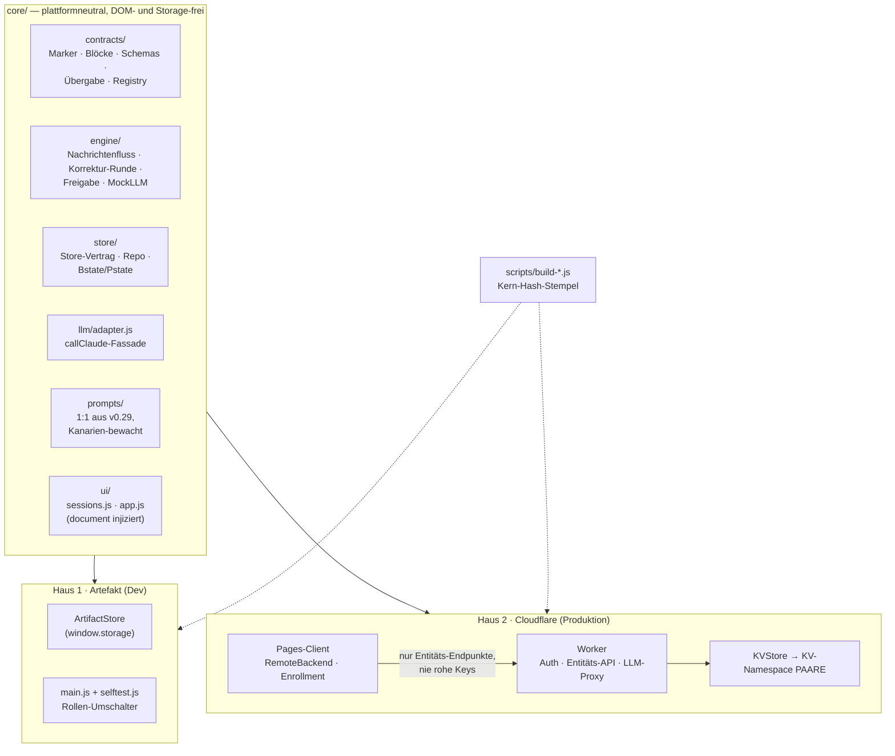
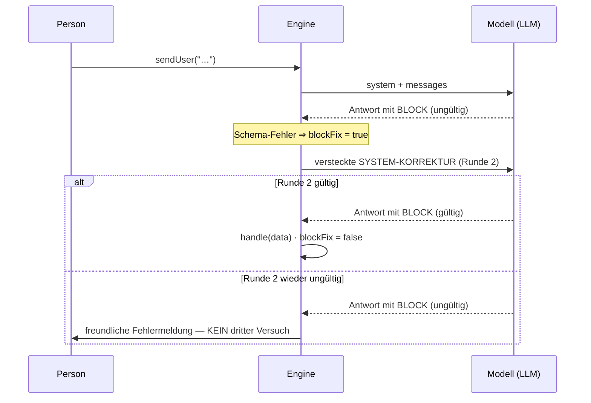
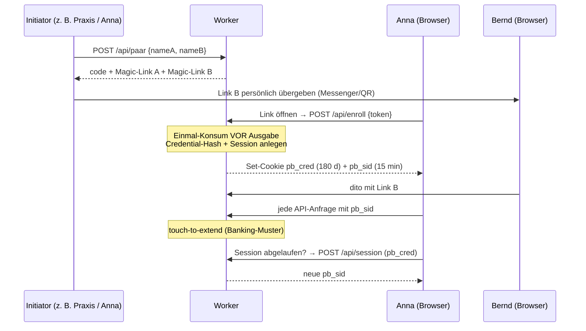
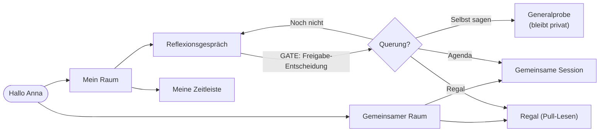
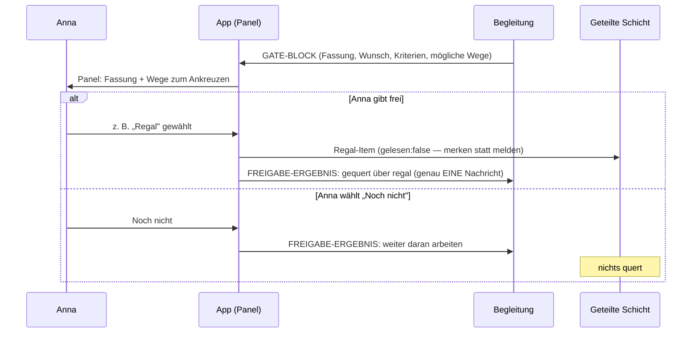
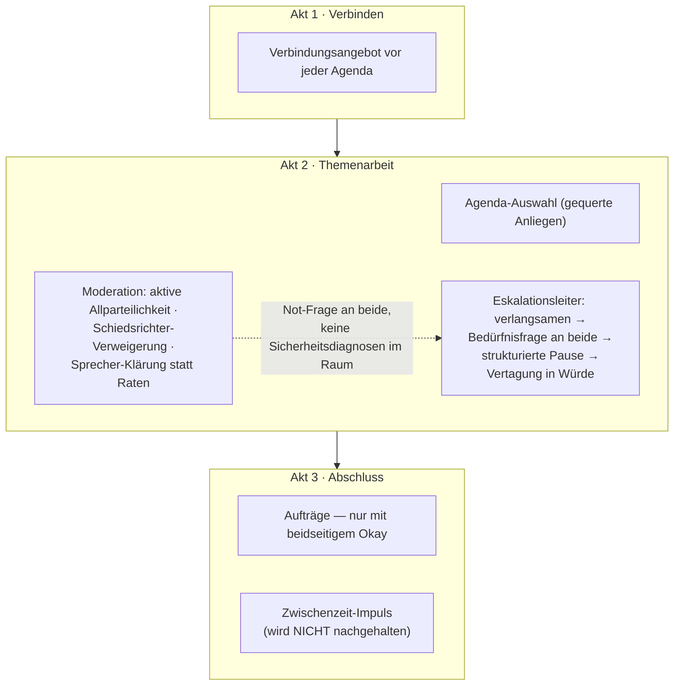
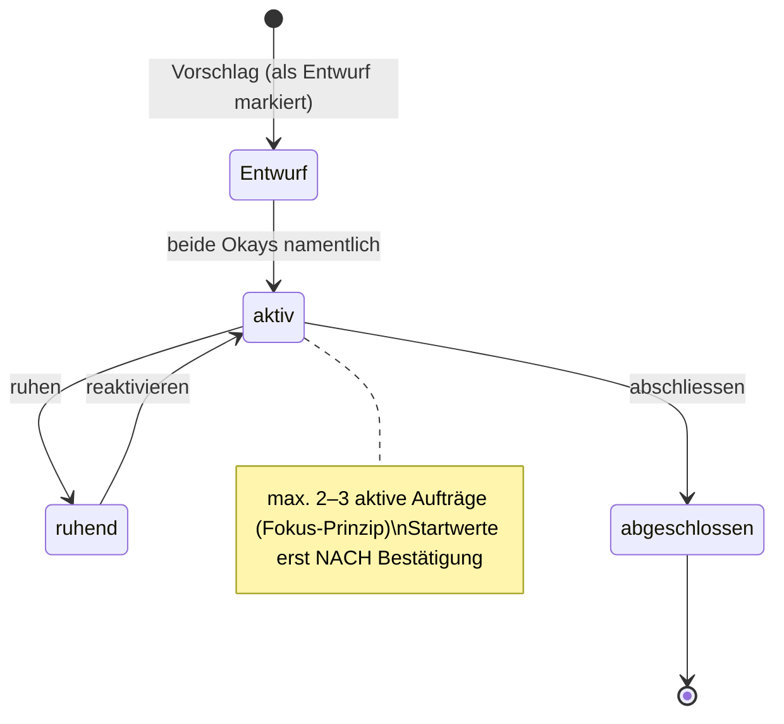

# Paarbegleitung — Technische Spezifikation v1.0 (Neubau)

**Stand:** 2. Juli 2026 · Kern-Hash `409906ecdc453d72` · 208 Tests grün
**Löst ab:** Konsolidierte Systemspezifikation v0.5 (Prototyp v0.25/v0.29)
**Vertiefende Dokumente:** Haltungs-Charta, Grundprämissen & Sicherheit, Slices 1–5, Eval-Harness, Eval-Backlog, v2-Flag-Spezifikation

---

## 0. Zweck und Leseführung

Dieses Dokument beschreibt das System **Paarbegleitung** nach dem Neubau v1.0: eine LLM-gestützte Begleitung für Paare, bei der jede Person einen geschützten Einzelraum hat und das Paar einen gemeinsamen Raum. Es richtet sich an drei Leserollen:

- **Konzeptionell Interessierte** lesen §1 (Idee), §7 (Nutzersicht) und §10 (Grenzen).
- **Entwickler:innen** lesen §2–§6 (Architektur, Verträge, Daten, Auth, Adapter) und §8 (Tests/Evals).
- **Betreiber:innen** lesen §9 (Deployment Schritt für Schritt).

Die *Haltung* des Systems (Spiegel-Grammatik, Allparteilichkeit, Sicherheits-Weiche usw.) ist in der Haltungs-Charta normiert; diese Spezifikation beschreibt, **wie die Technik diese Haltung erzwingt statt nur zu erbitten**.

---

## 1. Produktidee und Grundprinzipien

### 1.1 Kernkonzept

Partner sind in akuten Konfliktmomenten oft nicht reflexionsfähig (Eskalation, Flooding, Kommunikationsabbruch). Die Paarbegleitung schließt diese strukturelle Lücke: ein **ständig verfügbarer, verschwiegenheitsfähiger Reflexionspartner** für jede Einzelperson, dessen Wirkung über verbesserte Selbstregulation in die Paardynamik zurückfließt — nicht über direkte gemeinsame Intervention.

### 1.2 Geheimnis-Architektur (zwei Ebenen)

| Ebene | Inhalt | Vertraulichkeit |
|---|---|---|
| **Ziel-/Kontraktebene** | Gemeinsame Ziele, Aufträge, Befunde — inkl. explizit gemachter konstitutiver Annahmen | **keine** Vertraulichkeit zulässig; alles ist beiden bekannt |
| **Methoden-/Selbstebene** | Der Weg jeder Person dorthin: Reflexionsgespräche, Generalproben, Zeitleiste | Vertraulichkeit **zulässig und geschützt** |

Ein Täuschungsziel kann kein gemeinsames Ziel sein — es zu teilen löst die Täuschung auf. Die Schranke ist strukturell und autonomiebasiert, nicht moralisch. Kommunikationsglättung ist akzeptabel, solange sie an eine Bewegung Richtung Authentizität gekoppelt bleibt; der Fehlermodus ist dauerhaft stabilisierte Verdeckung.

**Neu in v1.0:** Diese Architektur ist keine Konvention mehr, sondern **serverseitig erzwungene Eigenschaft** (§5) mit ausführbarer Auth-Matrix als Beweis.

### 1.3 Etablierte Designprinzipien

- **Merken statt melden** — Pull-basiertes Lesen (Regal) statt Push-Benachrichtigung.
- **Erst verbinden, dann verhandeln** — die gemeinsame Session beginnt mit einem Verbindungsangebot vor der Agenda.
- **Das Gegenüber ist mein Spiegel, nicht mein Richter** — wechselseitige Wahrnehmungsdaten fließen unter diesem Prinzip in die geteilte Schicht.
- **Spiegel-Grammatik** — keine Prädikats-Urteile aus der Richterposition (auch keine positiven); Ich-Resonanz oder Schweigen.
- **Sicherheits-Dosierung als Gradient** — bei niedriger Sicherheit wenden sich Einladungen nach innen, statt binär zu blockieren.
- **Fokus-Prinzip** — maximal 2–3 aktive Aufträge, ideal 1–2; Aufträge tragen Status (aktiv/ruhend/abgeschlossen) und qualitative Zielmarker.

---

## 2. Architektur: „Ein Kern, zwei Häuser"

### 2.1 Übersicht

Ein plattformneutraler Kern (`core/`) trägt beide Zielformen. Der Build erzeugt aus demselben Kern das **Artefakt** (Entwicklungsumgebung, eine HTML-Datei) und die **Cloudflare-Form** (Produktion: Worker + KV + statische Seiten). Ein **Paritäts-Wächter** stempelt beide Builds mit demselben Kern-Hash und wird rot, sobald eines driftet.



**Die entscheidende Asymmetrie:** Im Artefakt lebt die komplette Speicherschicht (Repo/Bstate/Pstate) clientseitig gegen `window.storage`. In der Cloudflare-Form lebt **dieselbe Schicht im Worker** gegen KV — der Browser-Client dort sieht nie rohe Keys, sondern nur Entitäts-Endpunkte hinter der Session. Die Speicherautorität wandert dorthin, wo sie durchgesetzt werden kann.

### 2.2 Schichtenmodell

| Schicht | Modul | Verantwortung | Kennt |
|---|---|---|---|
| Verträge | `core/contracts` | Marker, Block-Parsing, Schemas, Übergabe-Filter | nichts außer Text/JSON |
| Engine | `core/engine` | Nachrichtenfluss, Dispatch, genau eine Korrektur-Runde | Verträge; LLM injiziert |
| Speicher | `core/store` | Store-Vertrag, Key-Autorität (Repo), Bündel | Store injiziert |
| Adapter | `core/llm` | Provider-Übersetzung, drei Transportmodi | fetch injiziert |
| Prompts | `core/prompts` | Charta-tragende Systemtexte | nichts |
| UI | `core/ui` | Session-Definitionen, DOM-Schicht | Backend-Fassade, document injiziert |
| Plattform | `platforms/*` | Träger: window.storage / KV, Auth, Boot | Kern |

Jede Injektion (LLM, Store, fetch, document, Uhr) existiert, damit die Schicht ohne ihre Umgebung testbar ist — Testbarkeit war Konstruktionskriterium, nicht Nachrüstung.

### 2.3 Die drei Verträge (das eigentliche API zwischen Modell und App)

1. **Marker → Panel.** Eine Marke wie `[[REGLER]]` **allein in der letzten Zeile** einer Assistant-Nachricht öffnet das registrierte Panel. Nur-Erwähnung mitten im Text feuert nicht (Verschärfung gegenüber v0.29, mit dokumentierendem Test). Das Panel antwortet über `submitToolResult` mit **genau einer** User-Nachricht — dem einzigen Rückkanal.
2. **Block → Schema → Handler.** Strukturblöcke (`TIMELINE-BLOCK … END TIMELINE-BLOCK`) werden geparst (Markdown-Zaun-tolerant, aber ohne JSON-Reparatur) und gegen ihr Schema geprüft. Ungültig ⇒ **genau eine** versteckte SYSTEM-KORREKTUR-Runde; scheitert auch sie, erhält die Person eine freundliche Fehlermeldung — nie ein dritter Automatikversuch.
3. **Übergabe.** `freigebeUebergabe()` ist der **einzige** Schreibpfad privat → geteilt. `baueUebergabe` übernimmt ausschließlich `id` und `text` je Item — Fremdfelder (Rohformen, private Notizen) queren strukturell nicht.



### 2.4 Blocktypen und Sessions

| Block | Session | Wirkung |
|---|---|---|
| `TIMELINE-BLOCK` | Reflexionsgespräch | Eintrag in die private Zeitleiste; Session `finished` |
| `GATE-BLOCK` | Reflexionsgespräch | öffnet das Freigabe-Panel (Querung ist Personen-Entscheidung) |
| `MOMENT-BLOCK` | Gemeinsame Session | Protokoll-Eintrag; Session `finished` |
| `GOAL-BLOCK` | Gemeinsame Session | Auftrags-Änderungen (Konsens-Zwang im Schema, §7.5) |
| `CLOSURE`/`GATE` | Kernwetten-Einzelsession | Übergabe-Kandidaten / Sicherheits-Weiche |
| `QUALITYTIME-BLOCK` | Qualitätszeit-Fächer | 2–3 Einladungen zu gemeinsamen Momenten (mind. eine Resonanz-Quelle) |
| `CLARIFICATION` | Kernwetten-Auflösung | gemeinsamer Befund inkl. `vonBeidenBestaetigt` |

---

## 3. Datenmodell und Speicher

### 3.1 Store-Vertrag und Key-Autorität

Der Kern kennt **einen** Store-Vertrag (`get/set/del/list`, mit geteiltem und privatem Namensraum) und drei Implementierungen: `MemoryStore` (Tests), `ArtifactStore` (window.storage), `KVStore` (Cloudflare-KV, serverseitig). Dieselbe Vertrags-Testsuite läuft gegen alle drei.

**Repo** ist die einzige Stelle mit Key-Wissen (per Grep-Wächter-Test bewacht):

```
p:<NS>:<paarCode>:<modulId>:<teil>        z. B.  p:PB:k7x2a1:betrieb:bstate
```

Lese-Cache TTL 12 s, write-through, Invalidierung bei `del` und Paar-Wechsel. Jedes Objekt trägt `_schema` (aktuell 1) als Migrations-Tür. Kein Legacy-Fallback (Ballast-Register §1.1): der Neubau startet mit einem Key-Schema.

### 3.2 Bündel

- **Bstate** (geteilt): `auftraege · regal · agenda · messrunden · momentprotokoll · qz` in einem Objekt — 1 Read statt 6. Single-Flight für parallele Loads; **Lesen schreibt nie** (Defaults ohne Persistenz); Schreiben = frisch lesen → Feld ändern → Bündel schreiben (Last-Write-Wins mit millisekunden-engem Fenster); unbekannte Fremdfelder überleben (vorwärtskompatibel).
- **Pstate** (privat, je Rolle): `zeitleiste · generalproben`. Single-Writer je Rolle, identische Prinzipien.

### 3.3 System-Entitäten (nur Cloudflare, nur Worker)

```
sys/couple/<code>      { code, nameA, nameB, createdAt }
sys/magic/<token>      { code, role, expiresAt, used }      · Einmal-Token, 14 Tage
sys/cred/<sha256>      { code, role }                       · langlebig (Cookie 180 Tage)
sys/session/<sid>      { code, role, expiresAt }            · 15 min, touch-to-extend
```

Credentials liegen **nur als Hash** im Speicher; Session-IDs sind 128-bit-Zufall; Cookies sind HttpOnly, SameSite=Lax, Secure.

---

## 4. LLM-Adapter

Fassade stabil über alle Umgebungen: `callClaude(system, messages) → { text, stop, usage }`.

| Modus | Wo | Auth | Verwendung |
|---|---|---|---|
| `keyless` | Artefakt-Sandbox | Sandbox injiziert | Entwicklung |
| `direct` | Node / Worker | eigener API-Key | Eval-Runner; serverseitig im LLM-Proxy |
| `proxy` | Browser (Cloudflare) | Session-Cookie | Produktion — Key bleibt serverseitig |

Provider: **anthropic** (mit Rolling-Prompt-Cache: `cache_control` auf System-Prompt und letztem Turn — der wachsende Prefix wird beim Folgeaufruf zum Cache-Treffer) sowie **mistral/openai** (OpenAI-kompatibel: `role:system`, Bearer). Nicht-Anthropic-Provider laufen nur im direct-Modus. Ein Provider-Wechsel (z. B. Mistral für EU/DSGVO in Produktion) ist eine Konfigurationszeile im Worker-Environment — genau der in der Provider-Strategie geforderte Adapter.

Detail mit eigenem Test: **versteckte Korrektur-Nachrichten gehen ans Modell mit** (`hidden` ist reine Anzeige-Semantik); Meta-Felder queren nicht in den Request.

---

## 5. Auth-Modell (Magic-Link) und Durchsetzung

### 5.1 Ablauf



### 5.2 Server-seitige Durchsetzung (der Kern)

**Rolle und Paar-Code stammen ausschließlich aus der Session** — der Client nennt nie eine Rolle, nie einen Code. Query-Parameter und Body-Felder mit Rollenangaben werden bewusst nicht konsultiert. Die ausführbare **Auth-Matrix** beweist gegen den deploy-gleich gebündelten Worker:

| Prüfung | Ergebnis |
|---|---|
| „Bernd liest Anna nicht" — regulär, `?role=A`, Body `{role:"A"}`, Pfad-Trickserei | nur eigene Daten / ≥400, kein Leck |
| Private Solo-Chats | je Rolle isoliert; geteilte Chats gemeinsam |
| Paar-Isolation | zweites Paar sieht nichts vom ersten |
| Ohne Session | 401 auf allen Daten- und LLM-Endpunkten |
| Magic-Link | Einmal-Konsum (2. Versuch → 410), Ablauf → 410 |
| Übergabe | Schema-Zwang und Fremdfeld-Filter wirken bis zur API |
| LLM-Proxy | Denial-of-Wallet: ohne Session kein Upstream-Kontakt |

### 5.3 Missbrauchsschutz am LLM-Proxy (Dosierung)

Drei deterministische Schichten prüfen **vor** jedem Upstream-Kontakt — abgewehrte Anfragen kosten nichts:

| Schicht | Default | Zweck | Verhalten |
|---|---|---|---|
| **Kontingent** | 90 Nachrichten je Person im **gleitenden 72-h-Fenster** | anhaltende Übernutzung dämpfen, den Krisenabend erlauben (~30/Tag im Schnitt; ein intensiver Abend mit 50 ist drin) | Hinweis ab 90 %; **Karenz** von 10 zum würdigen Abschluss der laufenden Session — nie ein Schnitt mitten im Gespräch |
| **Raten-Limit** | 8 Nachrichten/Minute | Automatisierung stoppen (kein Mensch schreibt 8 reflexive Nachrichten pro Minute) | „kurz durchatmen — in einer Minute geht es weiter" |
| **Duplikat-Wächter** | 3× identische (normalisierte) Nachricht in Folge | Bot-Muster „immer wieder gleiche Anfrage" kostenlos abfangen | Bitte um Umformulierung; die nächste andere Nachricht löst |

Die Grenze ist bewusst **zeitlich dosiert statt monetär**: Ein Dollar-Budget ist für Personen unlesbar und die falsche Sprache in einem intimen Raum; ein hartes Tageslimit bestraft den Krisenabend. Das gleitende Fenster ist zugleich therapeutisch begründet — es wirkt der Verdrängung der Ko-Regulation weg vom Partner entgegen (Sicherheits-Dosierung auf Systemebene). Alle Werte sind per Environment kalibrierbar (`QUOTA_LIMIT`, `QUOTA_FENSTER_TAGE`, `QUOTA_KARENZ`, `RATE_PRO_MINUTE`, `DUPLIKAT_SCHWELLE`); Zähler liegen als selbstverfallende KV-Einträge (`sys/quota/…`, `sys/rate/…`, `sys/wdh/…`). Kontingent-Hinweise reisen als `kontingent`-Feld in der Proxy-Antwort und erscheinen in der UI als sanfte Hinweis-Box, nicht als Fehler.

**Themen-Rahmen (Scope):** Die Betriebs-Prompts (solo, moment) tragen einen kanarien-bewachten THEMEN-RAHMEN: Der Raum ist für Beziehungsarbeit da; Bitten ohne jeden Beziehungsbezug (Code, Hausaufgaben, Recherche) werden freundlich zurückgelenkt — bei *unklarem* Bezug (Arbeit, Familie, Gesundheit, Geld) wird nach dem Bezug **gefragt statt abgewiesen**, denn persönliche Themen sind oft mehrdeutig. Der Scope ist Umlenkung, kein Schutz: Die Missbrauchs-Ökonomie regelt das Kontingent (jede Abwehr per Prompt kostet einen LLM-Aufruf; das Fenster begrenzt den Schaden strukturell). Auf semantische Bot-Klassifikatoren wird bewusst verzichtet — Latenz- und Kostenaufschlag pro Nachricht, Fehlalarme bei mehrdeutigen persönlichen Themen, und paraphrasierende Bots verbrennen ohnehin nur ihr eigenes Kontingent.

### 5.4 Bedrohungsmodell (ehrlich)

Geschützt wird gegen: neugierige Dritte, Link-Weiterleitung nach Konsum, Session-Diebstahl über Ablauf hinaus, Cross-Paar-Zugriffe, Kostenmissbrauch des LLM-Proxys. **Nicht** geschützt wird gegen: eine Person mit physischem Zugriff auf das entsperrte Gerät der anderen (dagegen hilft der 15-Minuten-Timeout nur begrenzt), und gegen den Betreiber selbst (der Worker kann prinzipiell alles lesen — Vertrauensanker ist die Betreiberrolle, perspektivisch Verschlüsselung at rest).

---

## 6. API-Referenz (Worker)

| Endpunkt | Methode | Auth | Zweck |
|---|---|---|---|
| `/api/health` | GET | — | Lebenszeichen, Kern-Version |
| `/api/paar` | POST | — | Paar anlegen → code + beide Magic-Links |
| `/api/enroll` | POST | Magic-Token | Einmal-Konsum → Cred- + Session-Cookie |
| `/api/session` | POST | pb_cred | neue Session aus Credential |
| `/api/me` | GET | Session | Rolle, eigener Name, Partnername |
| `/api/bstate/:feld` | GET/PUT | Session | geteiltes Bündel-Feld (Whitelist) |
| `/api/pstate/:feld` | GET/PUT | Session | privates Feld — **Rolle nur aus Session** |
| `/api/chat/shared/:id` | GET/PUT | Session | geteilter Chat |
| `/api/chat/mine/:id` | GET/PUT | Session | privater Chat der eigenen Rolle |
| `/api/handover` | POST | Session | Freigabe (eigene Rolle, Schema-Zwang) |
| `/api/handover/:rolle` | GET | Session | Freigaben lesen (geteilt, beide) |
| `/api/llm` | POST | Session | LLM-Proxy; Key serverseitig; Dosierung §5.3 — Kontingent/Rate/Duplikat antworten 429 mit freundlicher Meldung |

---

## 7. Design und Workflows aus Nutzersicht

### 7.1 Die zwei Räume

Nach der Anmeldung sieht die Person eine persönliche Oberfläche („Hallo Anna") mit zwei Türen:

- **Mein Raum** — geschützt, nur für mich: Reflexionsgespräche führen, meine Zeitleiste ansehen, Generalproben. Nichts hiervon ist für den Partner sichtbar, und das System gibt von sich aus nichts weiter.
- **Gemeinsamer Raum** — für uns beide: gemeinsame Sessions, das Regal, die Agenda, unsere Aufträge.



### 7.2 Workflow: Reflexionsgespräch (Einzelraum)

1. Anna startet das Gespräch (tippen oder per 🎤 diktieren); die Begleitung antwortet in Spiegel-Grammatik (Ich-Resonanz, keine Urteile) und mit Widerspruchs-Pflicht, wo Selbstabwertung kippt.
2. Am natürlichen Ende erzeugt das Modell einen `TIMELINE-BLOCK`. Die App speichert den Eintrag in Annas privater Zeitleiste — **die Rohform des Blocks ist nie sichtbar**, angezeigt wird ein freundlicher Platzhalter.
3. Erarbeitet Anna eine Fassung für Bernd, prüft die Begleitung sie gegen die Gate-Kriterien (kein Charakterzuschreiben, keine Generalisierung, Situationsbezug, Selbstanteil; sensible Gegenstände bleiben beim Namen genannt) und legt sie per `GATE-BLOCK` **Anna zur Entscheidung vor** — nie dem System.

### 7.3 Workflow: Querung (Gate)



Die Sicherheits-Dosierung wirkt hier als Gradient: äußert Anna Angst **vor** Bernds Reaktion, wenden sich Einladungen nach innen (weiter im Einzelraum) statt Richtung Querung zu drängen.

### 7.4 Workflow: Gemeinsame Session (Drei-Akt-Struktur)



### 7.5 Aufträge: Konsens ist im Schema erzwungen

Ein gemeinsamer Auftrag gilt erst nach explizitem, einzelnem, namentlichem Okay **beider** Personen; individuelle Aufträge brauchen das Okay der jeweiligen Person. Das ist keine Prompt-Bitte, sondern Schema-Pflicht: ein `GOAL-BLOCK` ohne `vonBeidenBestaetigt:true` bzw. `ownerBestaetigt:true` ist ungültig und läuft in die Korrektur-Runde (rote Linie AUF-01).



### 7.6 Auftragsklärung (Kernwetten-Modul)

Im persönlichen Raum startet jede Person die **Auftragsklärung**: 13 Lebensbereiche mit je zwei Reglern (Weiter erst, wenn beide angefasst sind — die Begleitung sieht im Gespräch nur qualitative Richtungen, nie Zahlen), Stapel-Ranking der Top 5 (Gegensatzpaare als getrennte Pole), blinde Partner-Vermutungen (Top 3 und größte Unzufriedenheit). Der Abschluss legt eine **Freigabe-Liste** vor: nur angekreuzte Punkte queren über die Übergabe in die geteilte Schicht — Rohformen und interne Tags strukturell nie. In der **gemeinsamen Klärung** werden die Freigaben trianguliert; ein gemeinsamer Auftrag erhält seine Startwerte **verdeckt** (nacheinander am selben Gerät, gleichzeitig aufgedeckt), der Befund persistiert erst mit `vonBeidenBestaetigt`.

### 7.7 Prozessreflexion und Qualitätszeit

**Prozessreflexion:** Jede Person gibt im eigenen Raum verdeckt drei Dinge ab — Nähe-Wert, Zweitschätzung (wie nah fühlt sich der andere vermutlich?), Passung je aktivem gemeinsamen Auftrag. Sind beide Beiträge da, ist die Runde bereit; aufgedeckt wird ausschließlich im gemeinsamen Moment, häppchenweise und Treffer zuerst. Das System trennt sauber: die **Erlebens-Differenz** ist ein Beziehungs-Befund (kein Fehler, kein Mittelwert), die **Lese-Genauigkeit** ist das Empathie-Signal.

**Qualitätszeit:** Der Fächer bietet 2–3 Einladungen zu kleinen gemeinsamen Momenten (Resonanz auf Benanntes + Negativraum aus dem Katalog, Angebots-Grammatik ohne Deutung). Die **Einladungsleiter** dosiert bei eingeschlafener gemeinsamer Zeit: sanft → Gründe-Frage nach ~4 Wochen → konkrete Terminhilfe → Pausen-Vereinbarung mit Wiedereinstiegs-Datum. Zweimal nicht aufgegriffene Bereiche werden ruhend und nicht mehr vorgeschlagen; nichts wird gemessen oder nachgehalten.

### 7.8 Das Regal (Pull-Prinzip)

Gequerte Fassungen liegen im Regal mit `gelesen:false` — **es gibt keine Benachrichtigung**. Bernd liest, wenn er bereit ist (merken statt melden), markiert selbst als gelesen und kann ein Anliegen **in die gemeinsame Agenda heben** (Herkunft bleibt sichtbar). Agenda-Punkte lassen sich als selbst geklärt abräumen — das wird gewürdigt, nicht gewertet. Beim Start einer gemeinsamen Session baut die App den **MOMENT-KONTEXT** (Aufträge, offene Agenda, frühere Momente, aufzudeckende Prozessreflexion, Zwischenzeit-Material) als versteckte erste Nachricht — das Modell bringt ihn dramaturgisch ein, das Paar sieht die Rohform nie.

---

## 8. Testframework und Evals

### 8.1 Vier Ebenen

| Ebene | Was | Werkzeug | Stand |
|---|---|---|---|
| 1 | Deterministische Strukturtests (Verträge, Schemas, Store, Adapter, Kanarien, UI-Drehbücher, Paritäts-Wächter) | Vitest, happy-dom | **138 grün** |
| 1.5 | Engine-Drehbücher mit Mock-LLM (Korrektur-Runde, Panels, Freigabe) | Vitest | **12 grün** |
| — | Worker-Auth-Matrix gegen echtes workerd | Miniflare | **21 grün** |
| 2 | Verhaltens-Szenarien mit echtem Modell + Judge | `npm run eval`, key-gated | lauffähig, Kern deterministisch bewiesen |
| 3/4 | Längsschnitt-Drift (Personas/Sentinels), Realdaten-Analyse | — | nur Struktur, bewusst geparkt |

Ein Befehl (`npm test`) fährt alles Deterministische; der deutsche Familien-Reporter fasst je Familie zusammen — bewusst ohne Gesamt-Score. Der „Test des Tests" beweist, dass die Suite überhaupt rot werden kann.

### 8.2 Eval-Runner (Ebene 2)

- **Judge ≠ Pipeline erzwungen** (Self-Preference-Bias): Default Sonnet führt aus, Opus richtet; gleiches Modell nur mit `--erlaube-gleiches-modell`.
- **Rote-Linien-Härteregel:** ein Treffer in n Samples ⇒ „ROT — menschlich gegenzuprüfen". Markiert: ESK-07/C1 (ungefragte Gewaltabfrage), AUF-01/C1 (unbestätigter Auftrag), LEAK-S1/C1 (Vertraulichkeitsbruch).
- **Unbewertet ≠ bestanden:** Judge-Ausfälle (z. B. `exceeded_limit`) führen zu Retry mit Backoff; bleibt ein Lauf unbewertet, ist das Szenario nicht grün.
- Ergebnisse append-only je Lauf in `evals/ergebnisse/`, mit Stand-Referenzen (Kern-Hash, Modelle, Judge-Prompt-Version).
- Start-Katalog: ESK-07, KOR-01, AUF-01, SYC-05, SPR-05, SPA-01 + Smoke LEAK-S1, DOS-S1, GATE-S1.

```
ANTHROPIC_API_KEY=sk-…  npm run eval                          # alle Szenarien
ANTHROPIC_API_KEY=sk-…  npm run eval -- --szenario AUF-01 --n 8
MISTRAL_API_KEY=…       npm run eval -- --provider mistral
```

---

## 9. Deployment — Schritt für Schritt

### 9.0 Voraussetzungen (beide Wege)

Auf dem eigenen Rechner: **Node ≥ 20** und npm. Projekt entpacken und einmalig:

```bash
unzip paarbegleitung-neubau-v1.zip && cd paarbegleitung
npm install
npm test          # Erwartung: 171 grün — erst dann weiter
npm run build     # erzeugt dist/paarbegleitung-dev.html und dist/cloudflare/
```

### 9.1 Weg A · Artefakt (Entwicklungsumgebung)

Zweck: schnelle Iteration, Selbsttests, UX-Läufe mit einer Person, die beide Rollen umschaltet. **Nicht** für echte Paare (window.storage teilt nur innerhalb einer Instanz; kein echtes Auth).

1. `npm run build` — die Datei `dist/paarbegleitung-dev.html` ist das komplette Artefakt (eine Datei, ~74 kB).
2. In claude.ai einen neuen Chat öffnen und die Datei hochladen mit der Bitte: *„Bitte stelle diese HTML-Datei unverändert als Artefakt bereit."* (Alternativ: Inhalt in ein bestehendes Artefakt einsetzen.)
3. Beim ersten Start: Namen für A und B eingeben → Rollen-Umschalter erscheint.
4. Knopf **Selbsttest** drücken: 11 sandboxfähige Kern-Checks (Verträge, Kanarien, Korrektur-Runde, Storage-Roundtrip) müssen „11/11 bestanden" melden.
5. Entwicklungszyklus: Änderung im Kern → `npm test` → `npm run build` → neue HTML hochladen. Der Kern-Hash im Fußbereich (`window.PAARBEGLEITUNG.coreHash`) zeigt, welcher Stand läuft.

Bekannte Sandbox-Grenzen (unverändert): kein Mikrofonzugriff — der 🎤-Knopf fällt hier automatisch auf den plattformbewussten OS-Diktat-Tipp zurück (mobile Tastatur-Mikro, Windows+H, macOS Fn Fn); keine echte Zwei-Geräte-Nutzung; LLM keyless nur hier.

### 9.2 Weg B · Cloudflare (Produktion / Testpaare)

Zweck: echte Zwei-Personen-Nutzung auf getrennten Geräten, ein Link pro Person, Key serverseitig. Free-Tier reicht für Testbetrieb.

**Schritt 1 — Konto und Werkzeug.** Cloudflare-Konto anlegen (kostenlos), dann lokal:

```bash
npm install -g wrangler
wrangler login          # öffnet den Browser zur Freigabe
```

**Schritt 2 — Build und KV-Namespace.**

```bash
npm run build
cd dist/cloudflare
wrangler kv namespace create PAARE
```

Die Ausgabe liefert eine `id`. In `wrangler.toml` den vorbereiteten Block einkommentieren und die ID eintragen:

```toml
[[kv_namespaces]]
binding = "PAARE"
id = "…hier die ausgegebene ID…"
```

**Schritt 3 — LLM-Schlüssel als Secret** (bleibt serverseitig, landet nie im Client):

```bash
wrangler secret put LLM_API_KEY        # Anthropic- (oder Mistral-)Key einfügen
# optional:
# wrangler secret put LLM_PROVIDER     # anthropic (Default) | mistral
# wrangler secret put LLM_MODEL        # abweichendes Modell
# Dosierung kalibrieren (Defaults: 90 / 3 Tage / 10 / 8 / 3):
# wrangler secret put QUOTA_LIMIT · QUOTA_FENSTER_TAGE · QUOTA_KARENZ ·
#                     RATE_PRO_MINUTE · DUPLIKAT_SCHWELLE
```

**Schritt 4 — Deploy.**

```bash
wrangler deploy
```

Wrangler gibt die URL aus (z. B. `https://paarbegleitung.<konto>.workers.dev`). Statisches Frontend und API laufen unter derselben Adresse (Assets-Direktive) — kein CORS, Cookies bleiben first-party.

**Schritt 5 — Funktionsprobe.**

```bash
curl https://paarbegleitung.<konto>.workers.dev/api/health
# → {"app":"Paarbegleitung","core":"1.0.0","kv":true}
```

**Schritt 6 — Erstes Paar anlegen und Links übergeben.**

```bash
curl -X POST https://…workers.dev/api/paar \
  -H 'content-type: application/json' \
  -d '{"nameA":"Anna","nameB":"Bernd"}'
# → {"code":"…","links":{"A":"<tokenA>","B":"<tokenB>"}}
```

Daraus entstehen die persönlichen Zugangslinks (Übergabe-Variante: der Initiator erhält beide und reicht Link B persönlich weiter — Messenger, QR, Zettel):

```
https://…workers.dev/#t=<tokenA>     → an Anna
https://…workers.dev/#t=<tokenB>     → an Bernd
```

Beim ersten Öffnen konsumiert der Client den Token (einmalig!), setzt die Cookies und entfernt den Token aus der Adresszeile. Danach genügt die nackte URL; nach Session-Ablauf meldet das Credential-Cookie still neu an.

**Schritt 7 — Betrieb.**

- Neuer Stand: lokal `npm test && npm run build`, dann `wrangler deploy`. Der Kern-Hash in `/api/health` bzw. `data-core-hash` bestätigt den laufenden Stand.
- Logs bei Bedarf: `wrangler tail`.
- Kosten: Free-Tier (100 000 Requests/Tag, KV-Freikontingent) trägt Testpaare bequem; LLM-Kosten laufen über den hinterlegten Key — der Session-Zwang am `/api/llm`-Endpunkt verhindert anonyme Mitnutzung.
- Provider-Wechsel (z. B. Mistral für DSGVO-Anforderungen): `LLM_PROVIDER`/`LLM_MODEL`-Secrets setzen, neu deployen — keine Codeänderung.

**Häufige Stolpersteine:**

| Symptom | Ursache / Abhilfe |
|---|---|
| `/api/health` meldet `"kv":false` | KV-Block in wrangler.toml fehlt/ID falsch → Schritt 2 |
| „Dieser Zugangslink wurde bereits verwendet" | Einmal-Token wurde schon konsumiert (gewollt) → neues Paar oder neuen Link erzeugen |
| 401 auf `/api/llm` trotz App-Nutzung | Session abgelaufen und Cred-Cookie fehlt (z. B. Inkognito) → Link erneut wie in Schritt 6 ausgeben |
| LLM-Fehler „…benötigt einen API-Key" | Secret LLM_API_KEY nicht gesetzt → Schritt 3 |
| 429 mit freundlicher Meldung | Dosierung greift (Kontingent/Rate/Duplikat, §5.3) — gewollt; bei Testläufen QUOTA_LIMIT temporär erhöhen |

---

## 10. Grenzen, offene Punkte, Roadmap

**Bewusst offen (aus designfragen-status fortgeschrieben):**

- Ebene 3/4 des Eval-Harness (Drift-Messung mit Personas/Sentinels, Realdaten-Analyse) sind spezifiziert, aber geparkt bis zur Markreife-Phase.
- NOT-01 (Notbremse in der gemeinsamen Session, Marker fällt erst im Dialog) ist als Szenario-Kandidat notiert — einzige v2-Stelle ohne Offline-Eval.
- Verschlüsselung at rest gegen den Betreiber selbst; aktuell ist der Vertrauensanker die Betreiberrolle (§5.3).
- ~~Direkte Diktatfunktion~~ — **erledigt in v1.0**: 🎤-Knopf startet die Browser-Spracherkennung (de-DE, kontinuierlich, finale Ergebnisse kumulativ ins Eingabefeld); ohne Erkennung oder bei blockiertem Mikrofon (Artefakt-Sandbox) automatischer Rückfall auf den plattformbewussten OS-Diktat-Tipp. Hinweis: Die Web-Spracherkennung ist Browser-abhängig (Chrome/Edge/Safari ja, Firefox nein) — der Fallback deckt die Lücke.
- ~~UI-Tiefe~~ — **erledigt (Sprints 10–12):** Auftragsklärungs-Panels (Regler/Ranking/Startwerte/Freigabe), Regal-Heben mit Gelesen-Markierung, Agenda samt MOMENT-KONTEXT, Prozessreflexions-Widget mit häppchenweiser Aufdeckung, Qualitätszeit-Fächer mit Einladungsleiter und Ruhend-Regel.
- Verdeckte Mess-Werte liegen im geteilten Bstate; verdeckt ist eine UI-, keine Speicher-Zusicherung. Härtere Form wäre serverseitiges Aufdeckungs-Gating im Worker (fremde Beiträge erst liefern, wenn die Runde bereit ist) — sinnvolle nächste Sicherheits-Iteration.

**Nächste sinnvolle Schritte:** erster echter Eval-Lauf (`--szenario AUF-01 --n 8`), ein Testpaar auf der Cloudflare-Form, dann UI-Iterationen im gewohnten Rhythmus — jetzt mit Paritäts-Wächter im Rücken.
