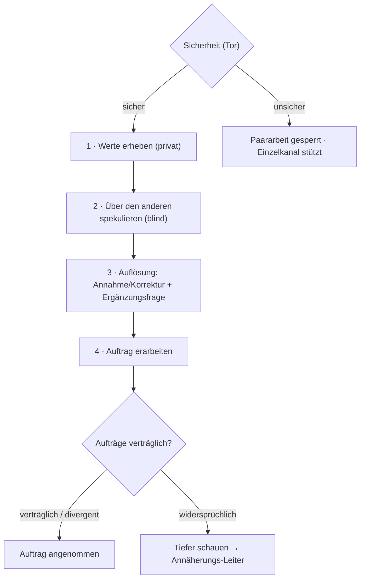
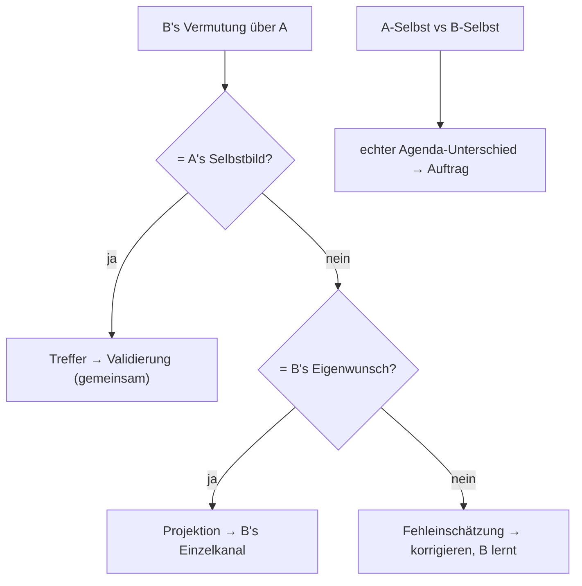
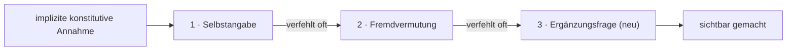
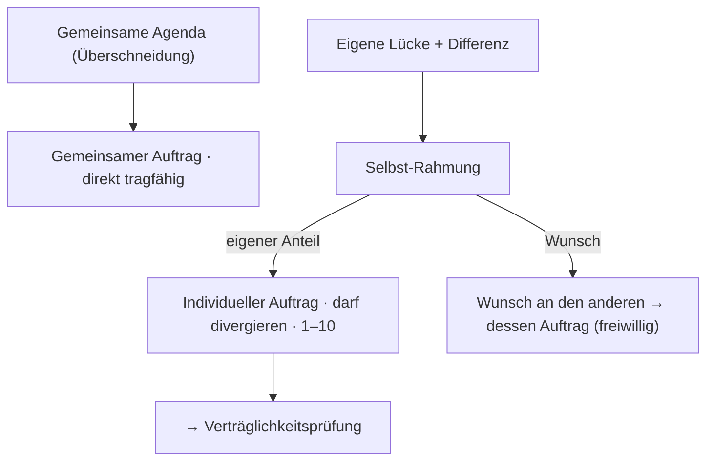
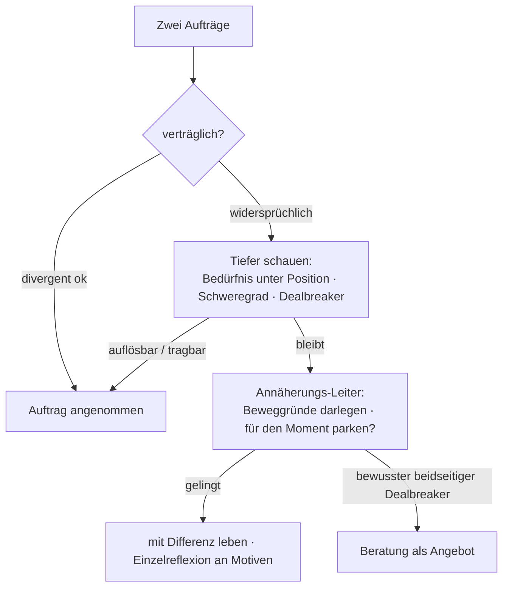

# Designnotiz: Slice 2 – Zielfindungsphase (Komponente A)

Vollständige Ausarbeitung des Zielfindungs- und Konfliktstrangs. Baut auf den
Grundprämissen und der Haltungs-Charta (separate Notizen) auf – Haltung und
Sprach-Grammatiken ("Spiegel statt Bewertung", annehmen/justieren/
zurückspiegeln) sind dort festgeschrieben. Operative Form der gemeinsamen
Ziel-/Kontraktebene.

## Einordnung & Kernwette

Slice 2 leistet, was die Architektur unter "implizite konstitutive Annahmen aktiv
hervorholen" und "Zielsetzung passiert in der transparenten gemeinsamen Schicht"
fordert. Es ist mehr als Onboarding: Es ist der **Test der zentralen Wette** der
ganzen Architektur – *kann das System implizite konstitutive Annahmen zuverlässig
hervorholen?* Wenn nicht, wackelt ein großer Teil des Wertversprechens. Das lässt
sich mit echten Paaren prüfen, ohne dass B, C oder spätere Slices existieren →
**Risiko-Retirement auf der Kernbehauptung**.

## Schnitt & Abhängigkeiten

Der Schnitt liegt zwischen zwei naiven Optionen: weder rein-gemeinsam (dann kommt
das Unbequem-Implizite nie heraus) noch getrennt-dann-gemerged (Lecktür, durch die
Einzelinhalt in die "gemeinsame" Schicht sickert). Stattdessen: **ein** gemeinsamer
Store mit **gestufter Sichtbarkeit**.

- **Abhängigkeit nach unten:** gemeinsamer Store, Entwurfs-Sichtbarkeitszustand,
  Kontrakt-Objekttyp, read-down. **Nicht** nötig: das volle Einzel→Gemeinsam-Gate
  (Slice 4), da Ziel-Elicitation kein nach oben fließender Geheiminhalt ist. Slice 2
  ist damit vor Slice 4 baubar.
- **Was aus Slice 2 herausfällt:** wiederkehrende wechselseitige Messung → Slice 3;
  Reframing roher Fremdwahrnehmung / Feed-vs-kuratiert → Slice 4; einzelne
  Selbstmusterarbeit → B/Slice 1; Qualitätszeit → abgekoppelt.
- **Teil-Rückbindung an Slice 4:** Das Aufdecken *unflatternder* Vermutungen
  (besonders Befürchtungen) ist dieselbe Bewegung wie das Spiegeln roher
  Fremdwahrnehmung und braucht Reframing. Empfehlung: v1 der Spekulation auf
  **Wünsche + gemeinsame Arbeitsthemen** beschränken (positiv/neutral, kaum
  Reframing-Bedarf); Befürchtungs-Raten kommt dazu, sobald Slice 4 existiert.

## Architektur-Verfeinerung: gestufte Sichtbarkeit

Der Kontrakt-Store braucht einen dritten Sichtbarkeitszustand: **Entwurf,
autoren-privat, aber für die gemeinsame Schicht bestimmt und so gelabelt** – klar
getrennt vom geheimnisfähigen Einzelkanal. Ziele liegen nie in B's Geheimkanal; sie
entstehen im gemeinsamen Store als private Entwürfe und werden erst durch eine
**verpflichtende gemeinsame Bestätigung** bindend, in der beide alles sehen. Kein
separater Store → kein Merge → die Lecktür bleibt zu.

## Reihenfolge (oberstes Tor: Sicherheit)

Vor allem anderen steht die **Sicherheitsfrage** (siehe Grundprämissen). Erst wenn
der Raum hinreichend sicher ist, beginnt die Zielfindung. Die Sicherheitsdimension
wird nie gespiegelt und verlässt den Einzelkanal nicht.

## Workflow (Überblick)

## Schritt 1 – Werteerhebung (privat)

Wert-*Domänen* mit konkreten, bewertbaren Items. Domänen so gewählt, dass die
typischen impliziten konstitutiven Annahmen darin auftauchen müssen:

- **Nähe ↔ Autonomie** (Tradeoff-Achse, mappt auf Pursuer-Withdrawer)
- **Exklusivität & Treue** *(konstitutiv-Kandidat)*
- **Finanzielle Gestaltung** *(konstitutiv-Kandidat)*
- **Ehrlichkeit ↔ Harmonie** (Tradeoff)
- **Verlässlichkeit & Verbindlichkeit**
- **Rollen & Fairness** (Hausarbeit, Mental Load, Karriere-Priorität)
- **Sexualität & körperliche Nähe**
- **Familie & Kinder** *(konstitutiv-Kandidat)*
- **Wachstum & Entwicklung**
- **Wertschätzung** (Love-Languages-nah)
- **Gemeinsamer Sinn / Vision**
- **Soziales Leben**

**Zwei Erhebungsmodi (beide einsetzen, sie beantworten Verschiedenes):**

- **Skalierung, zweidimensional:** Wichtigkeit (1–10) *und* Ist-Zufriedenheit
  (1–10) pro Domäne. Die **Lücke Wichtigkeit − Zufriedenheit** zeigt die
  Prioritätsbereiche (hohe Wichtigkeit + niedrige Zufriedenheit = hier arbeiten).
- **Priorisierung** (erzwungenes Ranking, "was würdest du am wenigsten aufgeben?")
  holt die *Ordnung* heraus – wo die konstitutiven Annahmen sitzen. Robuster gegen
  soziale Erwünschtheit als die Skala.
- **Dealbreaker-Flag** pro Wert: nicht-verhandelbar (konstitutiv) vs. Präferenz.
  Operationalisiert die impliziten konstitutiven Annahmen und liefert das Gewicht
  für die spätere Verträglichkeitsprüfung.

**Gegen den Fragebogen-Charakter:** Die Zahlen sind das Gerüst, nicht das Produkt.
Eine auffällige Bewertung triggert die Nachfrage ("du hast Autonomie hoch und Nähe
niedrig gerankt – erzähl mir davon"). Erst da kommt das Eigentliche.

## Schritt 2 – Spekulation über den anderen (blind)

Jeder spekuliert über den anderen: dessen **Wünsche**, **Befürchtungen** (zunächst
zurückgestellt, s. o.) und **"woran will dein Partner vermutlich *gemeinsam*
arbeiten"** (empathisch, nicht verordnend – Hoheit bleibt beim anderen).

**Harte Architektur-Bedingung:** Schritt 2 läuft pro Partner **blind** – der
Spekulations-Prompt hat Lesezugriff nur auf das *eigene* Schritt-1 und generische
Vorlagen, **nie** auf die Selbstangabe des anderen. Sonst rät niemand, das System
füllt aus, und das Empathie-Signal verschwindet.

**Struktur spiegelt Schritt 1** (geschätzte Wichtigkeit pro Domäne, Top-Arbeits-
themen), sonst ist nichts vergleichbar. Nur die **Top-paar** raten lassen, nicht
alle zwölf (Ermüdung).

Damit entstehen pro Item **vier Objekte:** A-Selbst, B-Vermutung-über-A,
B-Selbst, A-Vermutung-über-B. Schöner Nebeneffekt: Das gemeinsame Arbeits-Material
entsteht aus diesen Listen – die Überschneidung der "gemeinsam arbeiten"-Wünsche
ist die natürliche gemeinsame Agenda.

## Schritt 3 – Auflösung (Annahme oder Korrektur)

**Zwei verschiedene Vergleiche, nie verwechseln:**

- **Empathie** = Selbst vs. Fremdvermutung über dieselbe Person.
- **Agenda** = A-Selbst vs. B-Selbst → wollen sie dasselbe.

Beide können gleichzeitig auftreten: B kann A perfekt verstanden haben und trotzdem
Anderes wollen. Schritt 3 darf "ich hatte dich falsch im Kopf" nicht mit "wir wollen
Verschiedenes" zusammenwerfen.

**Triangulation der Fremdvermutung** (die eigentlich neue Mechanik): B's Vermutung
über A gegen *zwei* Bezugspunkte halten.

- B-Vermutung ≈ A-Selbst → **Treffer** → Validierung (gemeinsam; Treffer sind
  bindende Verbindungsmomente, nicht "nichts zu lernen").
- B-Vermutung ≠ A-Selbst, aber ≈ B-Selbst → **Projektion** → B's Einzelkanal
  ("möchtest du das für dich mitnehmen?"). Zweier-Fund: zugleich Projektions-Hinweis
  *und* echter Agenda-Unterschied. Das System meldet die Projektion **nicht** an A;
  A bekommt nur den neutralen Befund ("B hat sich X vorgestellt, du sagst Y").
- B-Vermutung ≠ beidem → **Fehleinschätzung** → korrigieren, B lernt.

Orthogonal: A-Selbst ≠ B-Selbst → **echter Agenda-Unterschied** → fließt in den
Auftrag/die Verträglichkeitsprüfung.

**Vierte Kategorie – die Ergänzungsfrage (Auslassung):** Am *Ende* der Auflösung,
nach dem Bestätigen/Korrigieren der einzelnen Vermutungen, beidseitig:
**"Würdest du dem noch etwas hinzufügen, was dein Partner nicht benannt hat?"** Das
fängt den Fehlschlag durch *Weglassen* (nicht durch Falsch-Raten) und ist das
stärkste Netz für die implizite konstitutive Annahme: Sie rutscht durch Schritt 1
(man nennt das Selbstverständliche nicht) *und* durch Schritt 2 (der Partner teilt
sie oder sieht sie nicht); erst die Frage nach der Leerstelle stößt sie an.

- Ungefährlichste Bewegung (A spricht über A → kein "du bist X"-Wundrisiko), darf
  daher schon in v1 vorne stehen, *vor* dem Reframing.
- Routing wie der Rest; eine als Dealbreaker markierte Ergänzung, für die B völlig
  blind war, ist eines der gewichtigsten Signale der Phase.
- Zugleich **Selbsterkenntnis-Netz:** Schritt 1 ist nicht das letzte Wort; etwas
  bislang unbewusst Selbstverständliches kann hier erstmals als eigener Wert
  auftauchen.

**Reihenfolge & Responses:** zuerst Treffer (Verbindung), dann Divergenzen
(Neugier statt Fehler). Auf Vermutungen über sich selbst antwortet man mit
**annehmen / justieren ("nein, eher so") / zurückspiegeln ("nein – aber vielleicht
ist es dein Thema?")**. Das Zurückspiegeln landet als Saat im *eigenen*
Reflexionskanal des Vermutenden, nicht als geteiltes Urteil (sonst Gegenanklage).

**Selektives-Aufdecken-Leitplanke:** A kann nur die Selbstangaben freigeben, bei
denen B richtig lag (sieht gut aus, verzerrt das Bild). Das System kann das nicht
erzwingen (Hoheit) und nicht an B verraten (Geheimnisfähigkeit), aber im *eigenen*
Kanal sanft anstoßen – Trajektorie-Bedingung.

**Bestätigungs-Schleife:** Das System schlägt Treffer/Lücke nur *vor*; die Partner
bestätigen ("Spiegel, nicht Bewertung").

**Triangulation (Schritt 3):**

**Drei Netze für die implizite konstitutive Annahme:**

## Schritt 4 – Auftragsbildung

Rohstoff aus 1–3: eigene Lücke (Wichtig − Ist), bestätigte Überschneidung, echte
Unterschiede, korrigierte Fehleinschätzungen. Daraus tragfähige Aufträge formen.

**Selbst-Rahmung (der entscheidende Move):** Ein Auftrag ist immer ein
*Selbst*-Auftrag, nie ein Fremd-Auftrag. Man kann die Veränderung des anderen nicht
in Auftrag geben, nur die eigene Selbststeuerung (Methoden-/Selbstebene). Jede
Forderung an den anderen wird aufgespalten in **eigenen Anteil** ("ich will daran
arbeiten, Kritik nicht sofort als Angriff zu hören") und **Wunsch an den anderen**,
den dieser frei in seinen eigenen Auftrag aufnehmen kann – oder nicht.

**Zwei Output-Arten:**

- **Gemeinsamer Auftrag** (aus der Überschneidung) – beide wollen ihn schon, kann
  sich nicht widersprechen, geht direkt durch (keine Verträglichkeitsprüfung nötig).
- **Individuelle Aufträge** (eigener Anteil) – dürfen divergieren, gehen in die
  Verträglichkeitsprüfung.

**Messhaken von Geburt an:** Jeder Auftrag bekommt zwei 1–10-Skalen (s.
Messmodell): **Passung** ("trifft das Thema unseren Entwicklungsfokus?") und
**Wirksamkeit** ("wie wirksam fühle ich mich dabei?"). Passung ist eine Frage an
das Ziel, Wirksamkeit eine an das eigene Erleben – ein Unterschied zwischen
beiden Partnern beim selben Thema ist ein Gesprächsanlass für sich, kein
Genauigkeitsbefund.

**Die aufschlussreiche Lage:** hohe Passung bei niedriger Wirksamkeit. Dort ist
das Thema richtig gewählt und die Arbeit daran stockt – genau die Stelle, an der
Begleitung trägt. Niedrige Passung ist kein Versagen, sondern eine Einladung, den
Auftrag neu zu verhandeln.

**Empathie-Aufträge** ("ich will besser verstehen, was in dir vorgeht") bleiben
möglich und wertvoll – aber ausschließlich als **Selbstverpflichtung**, die eine
Person sich gibt. Das System schlägt sie nie vor und leitet sie nicht aus
Messwerten ab; formuliert jemand sie, wird sie aufgenommen wie jeder andere
Auftrag. *(S107, 2026-08-02: Der frühere Text leitete den Auftrag aus einer
"wiederkehrenden Fehleinschätzung" ab – beides gibt es nicht mehr, weder die
Fehleinschätzung noch die Ableitung durch das System. Begründung:
`docs/designnotiz-beziehungswesen.md`.)*

**Glättungs-Leitplanke:** Die Selbst-Rahmung ist eine Glättungs-Versuchung. Das
System darf nicht *jede* Forderung in "dein eigener Anteil" verwandeln und den
anderen aus dem Schneider lassen – manches ist legitim ein Anliegen an den anderen.
Der Wunsch-Kanal ist der Schutz: Er hält fest, dass es einen Anteil des anderen
*gibt*, ohne ihn zu verpflichten. Fiele er weg, hätte man die Entkopplung.

**Fokus-Regel: wenige Aufträge, ganz (Ergänzung aus der Slice-3-Session):**
Insgesamt höchstens **2–3 aktive Aufträge, im Idealfall 1–2** – sonst wird
Entwicklung zum Herumpicken ohne Vorankommen. Nicht jede Lücke wird Auftrag;
das Paar wählt, was jetzt dran ist. Aufträge tragen einen Status
(aktiv | ruhend | abgeschlossen); Neues bekommt Platz durch Abschluss oder
bewusstes Ruhend-Stellen ("für den Moment zurückstellen"). Erkannte
Differenzen und Wert-Lücken bleiben als Kontrakt-Material erhalten und können
später Auftrag werden. Praxis-Leitlinie, keine Invariante: Die Hoheit bleibt
beim Paar; das System hält die Linie im Gespräch ("mögt ihr erst einen
abschließen oder ruhend stellen?").

**Zielmarker als Ventil, das den Deckel erträglich macht:** Ein Auftrag trägt
untergeordnete **Zielmarker** – qualitative Konkretisierungen ("bessere
Konfliktfähigkeit" → keine gewaltvolle Kommunikation; kein dauerhaftes
Aus-dem-Kontakt-Gehen statt Klärung). Statt drei kleiner Aufträge: ein
Auftrag mit drei Markern. Zielmarker werden **nicht metrisiert** (keine
Verhaltenszähler, kein Punkte-Konto – skaliert wird nur die 1–10-Nähe am
Auftrag); sie sind Anker fürs Gespräch ("woran merkt ihr es?") und wachsen im
Betrieb aus der Trajektorien-Vertiefung weiter (Slice 3).

**Auftragsbildung (Brücke zur Verträglichkeitsprüfung):**

## Verträglichkeit & Annäherung

**Definition** "widersprechen": *divergent* (A arbeitet an Nähe, B an Autonomie –
verschieden, aber verträglich) vs. *widersprüchlich* (A's Auftrag verlangt eine
Veränderung von B, die B's Auftrag ausschließt). Nur Letzteres triggert die
Schleife.

**Zwischenschritt vor jeder Grenze (statt direkt "nicht annehmbar"):**

1. **Unter die Positionen auf die Bedürfnisse** – "mehr Nähe" vs. "mehr Autonomie"
   sieht widersprüchlich aus, darunter steht oft dasselbe (sich gewählt, sicher
   fühlen). Klassischer EFT-Move; viele Scheinwidersprüche lösen sich hier auf.
2. **Schweregrad + Dealbreaker-Status** – ein Unterschied auf einem Nicht-
   Dealbreaker ist tragbar (Auftrag darf mit Spannung angenommen werden); erst ein
   gravierender Unterschied auf einem *beidseitigen* Dealbreaker ist die echte
   Grenze.

**Annäherungs-Leiter (Differenzen sind der Normalfall, kein Notfall):** benennen →
beide legen ihre **Beweggründe für ihre Position** dar → fragen, ob es für beide in
Ordnung ist, es **für den Moment zurückzustellen** → in der **Einzelreflexion** an
den eigenen Motiven arbeiten. Im Regelfall ist Annäherung möglich, man lebt mit der
Differenz für den Moment, und die Einzelreflexion deckt die unbeleuchteten Motive
auf (Beispiel: scheinbarer Intimitäts-Wunsch nach außen entpuppt sich als
Kompensationsmuster + Fehldiagnose über die Zurückhaltung des Partners, die am *Wie*
statt am *Ob* hängt – beides veränderbar, sobald bewusst).

**Sicherheits-Abzweig:** Die Leiter gilt nur für Wert-/Agenda-Differenzen. Bei
Gewalt/Sucht/Zwang ist sie gegenindiziert → eigener Pfad im Einzelkanal, klare
Stellungnahme, Einzeltherapie vorrangig (siehe Grundprämissen, Open Point 6).

**Verträglichkeits-Logik mit Zwischenschritt:**

## Messmodell (Klärung)

"Messbarkeit" meint **Skalierung** "wie nah sind wir dem Ziel, Skala 1–10", *nicht*
Verhaltenszähler ("x mal pro Woche"). Vorteile: subjektiver Annäherungswert über
die Zeit statt Behaviorismus, vermeidet das Punkte-Konto. Die Differenz der beiden
Partner-Bewertungen desselben Ziels ist selbst ein Empathie-Signal. Framing als
felt sense jeder Person (Spiegel, nicht Bewertung), damit es nicht adversarial zum
Scoreboard wird.

**Zwei Eintragsarten, unterschiedlich behandelt:** *überprüfbare Ziele*
(skaliert/regelmäßig abgefragt) vs. *konstitutiver Rahmen / Annahmen* (benannt,
anerkannt, **nicht** metrisiert). Eine Annahme wie Exklusivität in eine KPI zu
verwandeln züchtet das Punkte-Konto; ein vages Ziel zu lassen, vermeidet
Überprüfbarkeit. Daher der Typ-Unterschied am Ziel-Objekt + Status-Feld
(aligned / aufgedeckt-divergent).

## Offene Punkte / im Slice verbleibend

1. **Operationalisierung der Sicherheits-Skala im Onboarding-Flow** (Einhängen in
   Komponente A) – noch nicht im Detail.
2. **Belastbarkeit der Tacit-Fragen** – die Kernwette: Holt das Fragen-Design das
   Unausgesprochene wirklich heraus? Mit echten Paaren zu prüfen.
3. **Erkennungsproblem** (Differenz vs. Sicherheitslage) – betrifft Slice 2 dort, wo
   eine als harmlos gerahmte Differenz eine Zwangsdynamik verdecken kann.
4. **Genaues "≈"** in der Triangulation (semantische Ähnlichkeit Selbst/Vermutung) –
   vom System vorgeschlagen, von den Partnern bestätigt.
