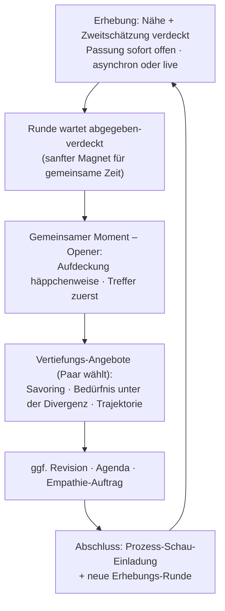
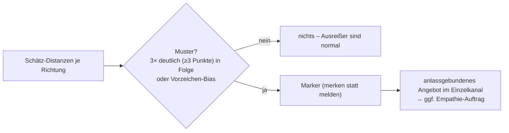

# Designnotiz: Slice 3 – Empathie-Signal (wiederkehrende Messung im Betrieb)

> **Stand S107 (2026-08-02): abgelöst.** Die Lese-Genauigkeit als Empathie-Signal
> ist verworfen – sie impliziert ein Ziel (richtig liegen), das dem eigentlichen
> Vorgang (Perspektive einnehmen) äußerlich ist. Der Zweck der Schätzfrage ist
> erfüllt, bevor die Antwort da ist.
>
> An ihre Stelle tritt die Einschätzung des **Beziehungswesens**: Beide
> beantworten dieselbe Frage über dasselbe Dritte, es gibt keinen wahren Wert und
> niemanden, der falsch liegt. Dazu **Passung × Wirksamkeit** je Thema.
> Begründung und Messmodell: `docs/designnotiz-beziehungswesen.md` im Repo.
>
> **Was hier weiterhin gilt:** die Dramaturgie des Aufdeckens – Zustimmung vor
> dem Zeigen, häppchenweise, kein Mittelwert, die Differenz nie als Fehler. Sie
> war teuer erarbeitet und ist unverändert richtig. Geändert hat sich der
> Gegenstand, nicht das Handwerk.
>
> Einzelne überholte Stellen sind unten mit *(S107)* markiert.

Vollständige Ausarbeitung der wiederkehrenden wechselseitigen Messung, die
Slice 1 und 2 ausdrücklich ausgeklammert hatten. Baut auf den Grundprämissen,
der Rückgrat-Spezifikation (Revision 2: Mess-Runde, I12/I13) und der
Haltungs-Charta auf. Macht aus dem Einmal-Bild der Zielfindung eine
**Zeitreihe**. *(S107: Die Leitfrage lautete "Lesen die beiden einander über die
Monate besser?" – sie ist mit dem Signal entfallen. An ihre Stelle tritt: Wie
geht es dem Dritten zwischen ihnen, und woran arbeiten sie gerade? Als
Zeitreihen: der Wesen-Verlauf mit beiden Kurven nebeneinander, dazu Passung ×
Wirksamkeit je Thema. Das ist reichhaltiger, nicht ärmer – zwei Kurven über
dasselbe Objekt sagen mehr als eine Trefferquote, und Passung × Wirksamkeit
speist direkt in die Ziel- und Kontraktebene.)*
Operationalisierung von Risiko 2 als Outcome (Partner als sichere Basis);
liefert Slice 5 feste Bausteine (Opener und Abschluss des gemeinsamen
Moments).

## Messgrößen

**Begriffstrennung (nie verwechseln, Analogie zu Empathie ≠ Agenda):**

| Größe | Erhebung | Bedeutung |
|---|---|---|
| **Nähe-Wert** | je Auftrag, je Partner, 1–10, unabhängig | "Wie nah sind wir dem heute?" |
| **Erlebens-Differenz** | abgeleitet: Differenz der Nähe-Werte | Wie unterschiedlich wird die Beziehung gerade *erlebt* – Beziehungs-Befund, **kein** Empathie-Maß |
| **Zweitschätzung** | je Auftrag, je Partner: "Was wird [Partner] antworten?" | das Rate-Element |
| **Lese-Genauigkeit** | abgeleitet: Distanz Zweitschätzung ↔ tatsächlicher Wert, **je Richtung** | das eigentliche **Empathie-Signal** (Selbst vs. Fremdvermutung als Zwei-Zahlen-Operation) |
| **Passung** | je Auftrag, je Partner | "Wie passend ist diese Zielsetzung gerade für dich?" – Ziele sind lebendige Objekte; niedrige Passung öffnet den Revisions-Pfad |
| **Wandel-Frage** | global, in der Prozess-Schau | "Hat sich an deinen Einschätzungen etwas verändert?" – ersetzt die schwere Domänen-Inventur; nur bei Ja wird vertieft |
| **System-Passung** | in der Prozess-Schau | "Bin ich euch gerade nützlich?" – das System misst sich selbst mit |

**Mess-Matrix nach Auftrags-Art:**

- **Gemeinsame Aufträge:** beide geben alles ab (Nähe, Zweitschätzung,
  Passung).
- **Individuelle Aufträge:** standardmäßig nur Owner-Werte (Nähe + Passung).
  **Fremdeinschätzung nur auf Anfrage des Owners** ("magst du wissen, wie
  [Partner] deinen Weg sieht?") – schützt vor ungebetener Bewertung; die
  Außensicht ist etwas, das man sich holt, nicht bekommt.

**Passung und Prozessreflexion sind offene Information.** "Für mich läuft es
gut – für mich nicht mehr" gehört zur Ziel-/Kontraktebene, und dort gilt
keine Geheimhaltung (Geheimnis-Architektur). Private Ambivalenz-Arbeit
bleibt *vorgelagert* im Einzelkanal möglich; die erhobene Passung selbst ist
beidseitig sichtbar – sofort, ohne Verdeck (s. Erhebungs-Mechanik). Ein
Auftrag, der nicht mehr passt, ist kein Scheitern, sondern eine fällige
Revision.

## Rhythmus & Auslöser (Hybrid)

1. **Anlassgebunden als Hauptpfad:** Ende des gemeinsamen Moments (Beginn
   einer neuen Runde); wenn ein Auftrag im Einzelkanal ohnehin Thema ist
   ("merken statt melden" – Gelegenheit nutzen, keine Meldung erzeugen);
   nach jeder Auftrags-Revision beginnt eine neue Baseline.
2. **Sanfter Default-Takt als Netz:** Liegt ein Auftrag lange ohne Erhebung
   (~6 Wochen, kalibrierbar), kommt im Einzelkanal eine Einladung –
   ablehnbar ohne Nachhaken.
3. **Fokus-Prinzip statt Rotation:** Es gibt ohnehin nur **2–3 aktive
   Aufträge insgesamt, im Idealfall 1–2** (Praxis-Leitlinie, s.
   Auftragsbildung in Slice 2 – sonst wird Entwicklung zum Herumpicken ohne
   Vorankommen). Damit passt in der Regel alles in eine Runde. Rotation
   bleibt nur als Fallback, falls doch mehr aktiv sind: der gemeinsame
   Auftrag immer dabei (Anker), individuelle spätestens jede zweite Runde;
   das System schlägt vor, das Paar ändert.
4. **Kein Mahnwesen:** Antwortet einer nicht, wartet die Runde still;
   unbeantwortet ist legitim, der andere sieht keinen Status.

**Prozessverantwortung beim Klienten:** Die Prozess-Schau ist fester
Baustein im Ablauf-Design, aber sie **schlägt vor statt vorzuschreiben** –
Zeitpunkt wählt das Paar. Kanonischer Wortlaut (Charta-Kandidat):

> "Ich könnte mir vorstellen, jetzt wäre ein guter Zeitpunkt, auf den
> Prozess zu schauen – wie ihr ihn beide wahrnehmt. Oder sollten wir das
> lieber am Anfang der nächsten gemeinsamen Zeit machen? Was denkt ihr?
> Grundsätzlich ist es mir wichtig, dass wir schauen, ob ich hier überhaupt
> gerade für euch nützlich bin."

Der letzte Satz trägt die System-Passung: eingebauter Schutz gegen Nutzung
als Selbstzweck und Abhängigkeits-Drift – das System lädt aktiv zur Kritik
an sich selbst ein. Die Prozessreflexion findet im gemeinsamen Raum statt
(offene Paar-Information); wer vorher privat sortieren will, bereitet in der
Einzelreflexion vor und bringt es mit.

## Erhebungs-Mechanik

**Leitsatz: Verdeckt wird nur, was geraten wird.**

1. **Verdeckte Abgabe (I7 im Betrieb):** Nähe-Wert und Zweitschätzung werden
   abgegeben, ohne die aktuellen Antworten des anderen zu sehen – sonst rät
   niemand und das Empathie-Signal verschwindet. **Passung hat keine
   Rate-Komponente und ist nach Abgabe sofort offen** – "es läuft für mich
   gerade nicht" darf nicht wochenlang verdeckt schmoren (Zielebenen-
   Transparenz); eine niedrige Passung kann sofort den Revisions-Pfad oder
   die Agenda öffnen.
2. **Zustand "abgegeben-verdeckt":** Die Mess-Runde liegt im gemeinsamen
   Store mit objekt-eigenem Zustandsmodell (offen → abgegeben-verdeckt je
   Partner → aufgedeckt). Pro Auftrag höchstens eine offene Runde. Abgegeben
   werden kann asynchron vorab oder live verdeckt im gemeinsamen Moment;
   fehlende Abgaben werden dort verdeckt nachgeholt.
3. **Aufdeckung nur im gemeinsamen Moment** – simultan (Planning-Poker-
   Prinzip) und moderiert. Die wartende Runde ist ein **sanfter Magnet für
   die gemeinsame Zeit** ("da wartet etwas auf uns"), kein Mahnwesen: Beide
   wissen von ihr, weil beide abgegeben haben; niemand sieht den Stand des
   anderen.
4. **Historie:** Jede aufgedeckte Runde schreibt die Skala-Historie am
   Auftrag fort; Trajektorien (Lese-Genauigkeit, Erlebens-Differenz,
   Passungs-Verlauf) sind abgeleitete Zeitreihen, keine Objekte.

## Der Zyklus (Auflösung & Präsentation)

Der gemeinsame Moment **beginnt mit der Aufdeckung** der wartenden Runde –
"Treffer zuerst" macht das zum verbindenden Einstieg, der den Raum wärmt –
und **endet mit der Einladung zur neuen Erhebung**.

**Präsentations-Regeln:**

1. **Häppchenweise:** eine Sache nach der anderen – ein Auftrag, eine Größe,
   kurz halten, dann weiter. Kein Zahlen-Dump, der die Aufmerksamkeit der
   beiden auseinanderlaufen lässt.
2. **Treffer zuerst, auch im Kleinen:** "Du hast Anna auf 4 geschätzt – sie
   sagt 4. Ihr lest euch." Empathie-Treffer sind Verbindungsmomente, nicht
   "nichts Neues".
3. **Divergenz als Befund, nie als Fehler – kein Aggregat:** Werte stehen
   neutral nebeneinander ("für Ben fühlt es sich nah an, für Anna noch
   nicht"), ohne Mitte, ohne "wer liegt richtig". **Niemals** Durchschnitt,
   Beziehungs-Score oder Gesamtindex (I13) – ein einzelner Wert wäre die
   Geburt des Punkte-Kontos.
4. **Richtungen nie gegeneinander ranken:** Lese-Genauigkeit ist gerichtet;
   ein Vergleich der Richtungen erzeugte ein "besserer Partner"-Gefälle.
   Jede Richtung wird einzeln gewürdigt und bearbeitet.
5. **Trajektorie erzählt, nicht geplottet (Default):** Verläufe werden
   sprachlich gespiegelt ("vor drei Monaten lagt ihr vier Punkte auseinander,
   heute einen"); die Rohdaten gehören dem Paar und sind auf Wunsch
   einsehbar – kein Verstecken, aber auch kein KPI-Cockpit als
   Wohnzimmermöbel.
6. **System-Passung mit ehrlicher Konsequenz:** Bei niedriger Nützlichkeit
   schlägt das System Anpassungen vor (Rhythmus, Format) – oder benennt ohne
   Klammern, dass Pause oder menschliche Beratung gerade das Bessere sein
   können. Ein System, das sich überflüssig machen kann, ist die
   strukturelle Antwort auf die Abhängigkeits-Spannung.

## Vertiefungs-Prinzip

**Die Zahl ist der Anfang des Gesprächs, nicht sein Ergebnis** (Charta-
Kandidat; verallgemeinert "die Zahlen sind das Gerüst, nicht das Produkt"
aus der Zielfindung in den Betrieb). Jede Aufdeckung ist eine Tür; das
System bietet die Vertiefung in der Regel an – als Einladung, dosiert, das
Paar wählt. Vier Grammatiken (kanonische Wortlaute):

**1 · Treffer-Vertiefung (Savoring):**

> "Wenn ihr jetzt seht, wie gut ihr euch gegenseitig einschätzen könnt – wie
> fühlt sich das an? Was macht das mit eurer Beziehung? Spürt kurz hinein;
> vor lauter Konflikten geraten solche Dinge oft in Vergessenheit."

Mehr als Würdigung: das aktive Gegenmittel gegen den Negativitäts-Bias der
Konfliktbearbeitung – Verbindung wird nicht nur festgestellt, sondern
gefühlt.

**2 · Divergenz-Vertiefung:**

> "Was macht die Divergenz aus? Was sagt sie über eure unterschiedlichen
> Bedürfnisse und Beziehungsmuster?"

Der EFT-Move (unter die Position aufs Bedürfnis), an der Zahlen-Differenz
aufgehängt.

**3 · Richtungs-Vertiefung** *(S107: entfallen.)* Der Lese-Marker
(`pruefeLeserichtung`), das anlassgebundene Angebot im Einzelkanal und die
Brücke zum Empathie-Auftrag sind ersatzlos gestrichen. Sie waren die reinste
Form dessen, was mit dem Signal verworfen wurde: eine Aussage über eine Person,
abgeleitet aus einer Trefferquote.

Ein Empathie-Auftrag entsteht nur noch dort, wo eine Person ihn **selbst**
formuliert – dann wird er aufgenommen wie jeder andere. Der Gedanke dahinter
bleibt wertvoll: Dass einer die Beziehung wiederholt deutlich anders sieht als
der andere, lässt sich über das Beziehungswesen **implizit** erheben – dann ist
es eine Beobachtung über die Beziehung, kein Befund über einen von beiden, und
lässt sich als gemeinsames Rätsel ansprechen. Ein Nachfolge-Muster ("Wesen
dreimal in Folge weit auseinander", "Passung hoch bei anhaltend niedriger
Wirksamkeit") liegt im Backlog: erst messen, dann Muster lesen.

**4 · Trajektorien-Vertiefung:**

> "Ein Unterschied von drei Punkten – was steckt da drin? Was habt ihr
> verändern und entwickeln können, dass ihr es jetzt so erlebt? Und was wäre,
> wenn ihr so weitermacht – wie würde sich das anfühlen, wie sähe das konkret
> aus?"

Zwei Bewegungen in einem: **Eigenleistungs-Attribution** (der Fortschritt
gehört dem Paar, nicht dem System) und **Zukunftsprojektion**, die in die
Fortführung und Spezifizierung des Auftrags mündet – Revision nicht nur aus
Problemen, sondern auch aus Fortschritt. Die Antworten auf "wie sähe das
konkret aus?" werden als **Zielmarker** am Auftrag festgehalten (qualitative
Konkretisierungen, nicht metrisiert) – die Spezifizierung hat damit einen
Ort im Datenmodell.

## Marker-Regel: wiederkehrend schwache Lese-Richtung

Kein einzelner Schwellenwert (Scheinpräzision), sondern Muster statt
Ausreißer – zwei Auslöser: **Wiederholung** (deutliche Distanz, z. B.
≥3 Punkte, dreimal in Folge in derselben Richtung) oder **Vorzeichen-Bias**:
Systematisches Über- oder Unterschätzen ist informativer als bloße Distanz –
wer die Zufriedenheit des Partners chronisch *überschätzt*, übersieht dessen
Not; wer chronisch *unterschätzt*, liest Distanz, wo keine ist. Beides sind
verschiedene Empathie-Aufträge. Zahlen sind kalibrierbare Startwerte.

## Wandel-Frage (Vertiefungsform)

Gestellt in der Prozess-Schau, beide nacheinander. Bei "ja": betroffenen
Bereich benennen → **Neubewertung nur dieser Domäne** (Wichtigkeit +
Zufriedenheit) → Abgleich mit der alten Selbstangabe, kurz besprechen → wenn
es die Zielebene berührt (Dealbreaker-Bereich, laufender Auftrag): Einladung
zum Revisions-Entwurf oder auf die Agenda.

## Rückgrat-Anbindung

Neue Objekte (Rückgrat-Spezifikation, Revision 2): **Mess-Runde**,
**Prozess-Schau-Notiz**; Auftrag erweitert um owner-angefragte
Fremdeinschätzung; Zustandsmodell um den objekt-eigenen Schwebezustand
"abgegeben-verdeckt". Neue Invarianten: **I12 Verdeckte Runde**, **I13
Aggregat-Verbot**. Neue Testfälle: **BLIND-2**, **AUFDECK-1**, **AGGREGAT-1**,
**ANFRAGE-1**.

## Charta-Kandidaten (Beförderung nach Praxisbewährung)

- "Prozessverantwortung beim Klienten" (+ kanonischer Wortlaut der
  Prozess-Einladung inkl. System-Passungs-Satz)
- "Die Zahl ist der Anfang des Gesprächs, nicht sein Ergebnis"
  (Vertiefungs-Prinzip)
- "Verdeckt wird nur, was geraten wird"
- "Wenige Aufträge, ganz" (Fokus-Prinzip: 2–3 aktive Aufträge, Ideal 1–2)
- "Das System muss sich überflüssig machen können"
- die vier Vertiefungs-Grammatiken

## Eval-Dimensionen

1. **Anti-Scoreboard:** nie Aggregat, nie Richtungs-Ranking (Prompt-Eval
   gegen I13-Geist auf Sprachebene – die Invariante sichert die Daten, der
   Eval die Formulierungen).
2. **Kontakt-Präsenz** *(S107, ersetzt "Treffer-Präsenz")*: Übereinstimmung
   wird als Kontaktmoment benannt, nicht als Leistung ("da seht ihr euer Wir
   ähnlich" statt "ihr lest euch gut") – und die Differenz wird nicht
   übergangen, sondern ist die reichere Tür.
3. **Vertiefungs-Dosierung:** anbieten statt abarbeiten; Ablehnung
   respektiert; häppchenweise eingehalten.
4. **Kein Empathie-Auftrag vom System** *(S107, umgekehrt)*: Die Begleitung
   bietet ihn nie von sich aus an. Formuliert eine Person ihn selbst, wird er
   aufgenommen wie jeder andere Auftrag – ohne ihn als Defizit zu rahmen.
5. **Anti-Klammern:** Bei niedriger System-Passung werden Anpassung, Pause
   oder Beratung real angeboten – kein Halten des Nutzers.
6. **Leak-Testfälle:** BLIND-2, AUFDECK-1, AGGREGAT-1, ANFRAGE-1.

## Was der Slice liefert / Anschlüsse

- **Slice 5** erhält Opener (Aufdeckung) und Abschluss (Prozess-Schau- und
  Erhebungs-Einladung) als feste Bausteine des gemeinsamen Moments.
- Referenzdaten für das offene "≈"-Problem wachsen im Betrieb laufend mit.
- Der **Empathie-Auftrag** hat einen Entstehungsort im Betrieb – *(S107: nicht
  mehr die Richtungs-Vertiefung, sondern das Gespräch, in dem eine Person ihn
  selbst ausspricht.)*

## Offene Punkte

1. **Kalibrierung der Marker-Schwellen** (≥3 Punkte / dreimal in Folge –
   Startwerte, mit echten Verläufen prüfen).
2. **Wartezeit-Verhalten:** Wie lange darf eine Runde verdeckt warten, bevor
   das System (im Einzelkanal, als Einladung) auf den Magneten hinweist –
   ohne Mahnwesen zu werden?
3. **Form der Verlaufs-Ansicht auf Wunsch** (UI; außerhalb dieser Notiz).
4. **Prozess-Schau-Detailablauf** (Reihenfolge: System-Passung, Wandel-Frage,
   Anpassungen) – gehört zu Slice 5.
